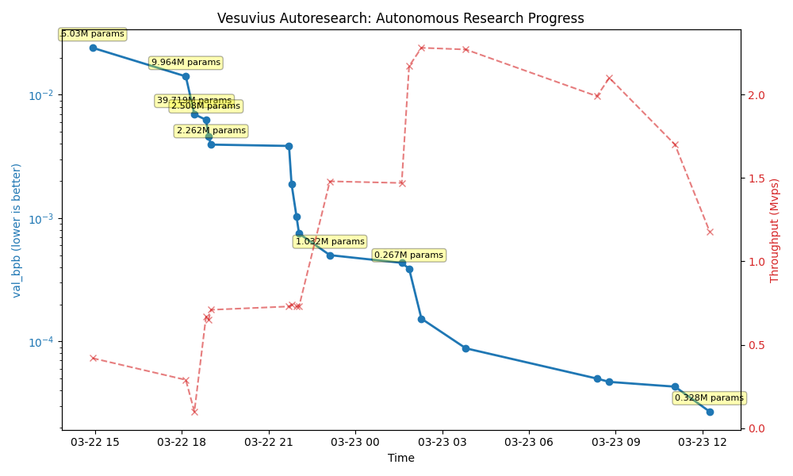

# bountyhunter: Vesuvius Autoresearch



*The first autonomous research swarm for the Vesuvius Challenge.*

> **Honest results, methodology, and negative results:** see [FINDINGS.md](FINDINGS.md).
> **Live experiment tracking:** [wandb dashboard](https://wandb.ai/jdmarrs-uc-davis/vesuvius-autoresearch).

`bountyhunter` is an experiment in having AI agents perform their own end-to-end computer vision research. It automates the cycle of hypothesis generation, hyperparameter optimization, model training, and performance evaluation to uncover the "Gold Standard" configurations for reading ancient carbonized scrolls.

## 🚀 Key Features

- **Autonomous Research Loop:** Automatically samples from a multidimensional configuration space (architectures, loss functions, augmentations).
- **Architecture zoo:** ResEnc-UNet (production), plus TimeSformer, ResNet3D-101, and Inception-I3D options. Note: at the prize's ~64 px window a full-resolution CNN outperforms the patch-based transformers (see [FINDINGS.md](FINDINGS.md)).
- **On-the-fly Multi-tasking:** Real-time 3D Structure Tensor and Ridge Map computation for rich structural supervision.
- **Topology-aware evaluation:** `centerline_dice` and `skeleton_distance_length`, evaluated at the topology-optimal binarization threshold (the Dice-optimal threshold understates topology ~2×).
- **Calibration Baselines:** Periodically re-evaluates against the fixed 2023 Grand Prize recipe to prevent research drift.

## Quick start

**Requirements:** A single NVIDIA GPU (tested on RTX 4090/H100), Python 3.10+, [uv](https://docs.astral.sh/uv/).

```bash
# 1. Install uv project manager (if you don't already have it)
curl -LsSf https://astral.sh/uv/install.sh | sh

# 2. Install dependencies
uv sync

# 3. Download data (~5 min)
uv run python scripts/archive/download_data.py --fragment 4

# 4. Run a single training smoke test (~30 s) to verify your setup
PYTHONPATH=. uv run python scripts/training/train.py --test

# 5. Kick off the autonomous research loop
./start.sh        # wraps: uv run python run_autoresearch_loop.py
./stop.sh         # graceful shutdown
```

## Running the agent

Spin up your coding agent of choice in this repo, then prompt something like:

```
Hi, have a look at docs/program.md and let's kick off a new experiment!
```

The `program.md` file is essentially a super lightweight "skill".

## 📈 Tracking progress

- **`history.tsv`**: Every evaluated cycle — `val_bpb`, topology metrics (`avg_skel_dist`, `avg_centerline_dice`), throughput, and the full config JSON.
- **`results.tsv`**: Experiments that beat the then-current baseline.
- **`prize_readiness.tsv`**: Per-cycle check of the model against prize submission gates.
- **`docs/LAB_NOTEBOOK.md`**: High-level strategic record of research milestones.
- **`sprint_logs/`**: Detailed per-shift execution traces and config samples.

## ✅ Validation

Use the project interpreter for tests; a system `pytest` may not have the GPU/CT
dependencies installed.

```bash
uv run python scripts/run_validation_tests.py
```

For prize-submission mechanics specifically:

```bash
uv run python scripts/build_scroll23_search_queue.py
uv run python scripts/rank_scroll23_candidates.py
uv run python scripts/run_ranked_inference.py
uv run python scripts/generate_submission_package.py
uv run python scripts/validate_prize_artifact.py --metadata submission_package_dry_run/metadata.json
```

## 🔬 Evidence & upstream contributions

- **GPU fiber/ridge detection for villa** ([ScrollPrize/villa#1033](https://github.com/ScrollPrize/villa/pull/1033)): closed-form 3×3 eigensolver replacing the cuSolver path that fails past ~64³, with tiled/halo execution (512³ in ~1 GB VRAM) and tiled-vs-dense parity tests. Validation details in [`reports/fibers_gpu_validation_2026-06.md`](reports/fibers_gpu_validation_2026-06.md).
- **Real-scroll runs:** vesselness on a 256³ PHerc0332 region in ~1.2 s — [contact sheet](reports/real_scroll_evidence/vesselness_contact_sheet.png), plus Scroll 2/3 candidate evidence under [`reports/scroll23_evidence/`](reports/scroll23_evidence/).
- **Optimized inference (Primus/LeJEPA loader):** diagnostics in [`reports/primus_optimized_inference_validation_2026-06.md`](reports/primus_optimized_inference_validation_2026-06.md).
- **Hallucination mitigation:** methodology in [`submission_package_dry_run/HALLUCINATION_MITIGATION.md`](submission_package_dry_run/HALLUCINATION_MITIGATION.md).

## Project structure

```
run_autoresearch_loop.py — autonomous experimentation manager (day/night shifts)
scripts/training/train.py — main training loop and evaluation
src/vesuvius_autoresearch/core/vesuvius_loader.py — data loading, ridge computation
vesuvius_model.py        — model architectures (ResEnc-UNet, GatedUNet, TimeSformer, ...)
scroll_augmentations.py  — scroll-specific augmentations (decohesion, squeeze, z-dropout, ...)
scripts/                 — inference, labeling, evaluation, and prize-packaging tools
docs/program.md          — agent instructions
pyproject.toml           — dependencies
```

## Design choices

- **Autonomous Tweak Families.** The loop script (`run_autoresearch_loop.py`) intelligently samples from different "families" of tweaks (LR, Architecture, Loss Balance) based on recent success.
- **Fixed Time Budget.** Training runs for a fixed wall-clock budget (default 15 mins for Day Shift, 60 mins for Night Shift). This ensures experiments are comparable and the agent optimizes for the best model *within the available compute*.
- **Multi-task Supervision.** Models are trained not just on ink labels, but also on auxiliary tasks like 3D ridge detection and structure tensor alignment to improve generalization.

## Scroll-specific augmentations

`scroll_augmentations.py` is a standalone, dependency-light library of nine
GPU-native augmentations that model scroll-CT artifacts (beam scatter,
compression, missing slices, Rician noise, …) for ink-detection training —
addressing [villa issue #201](https://github.com/ScrollPrize/villa/issues/201).
The training loop uses it directly. See **[docs/SCROLL_AUGMENTATIONS.md](docs/SCROLL_AUGMENTATIONS.md)**
for the per-family reference, usage, and the [before/after demo](reports/augmentation_demos/all_families.png).

## License

MIT
