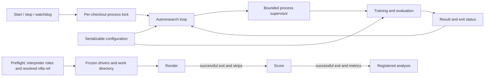

# Design and architecture review — 2026-10-01

Reviewed the CLI/operator experience, research orchestration, detector, and spiral
render/scoring pipeline at baseline `231fbdd0`. This is a software design review;
the repository's main product is a research workflow, not a browser interface.

The main weakness was inconsistent contracts between stages: a failed command
could look successful, preflight could validate different settings from execution,
and model configuration could disagree with tensor shapes. The fixes below make
those contracts explicit without changing published measurements or historical
research artifacts.

## Architecture

The separation between orchestration and research algorithms is appropriate.
The independent detector, shared metric contract, recorded source revisions,
pre-registered analyses, and published corrections are useful foundations. This
review preserves those boundaries and moves configuration and process control
out of training imports.

## Findings and fixes

| Priority | Finding | Implemented fix and evidence |
|---|---|---|
| P1 | Missing arms/strips and failed scoring could exit zero; an invalid arm path became an empty path. | Scoring validates inputs, records aggregate failures, and stops using an invalid directory. Behavioral shell tests cover each case. |
| P1 | A nonzero render exit still allowed scoring of leftover JPEGs. | The outer driver requires a successful render before scoring and propagates setup/render/score failures. A regression supplies stale images and verifies the scorer is never called. |
| P1 | Smoke checks and benchmarks had different cleanup from training; a TERM-resistant worker could keep the loop stuck or outlive its leader. | All three use `scripts/process_supervisor.py`, with session isolation, bounded TERM/KILL cleanup, and descendant cleanup. Tests launch real TERM-resistant workers, including one whose leader exits first. |
| P1 | The loop could promote a result file despite a failed training exit. | Promotion requires exit code zero. A complete simulated cycle writes a success result then exits nonzero; config and success weight remain unchanged. |
| P1 | Stop missed `python -u`, waited indefinitely, and allowed watchdog resurrection. | `scripts/loop_control.py` verifies the PID registered under the checkout's lock, persists the pause even when idle, and bounds the stop wait. Start, watchdog, and Makefile use the same control path. A competing launcher cannot erase a live PID. |
| P2 | Preflight checked `RENDER_VENV`/`SCORE_VENV`, but jobs ignored them; it checked `origin/main` even for a pinned study. | Jobs honor the named roles and resolve relative interpreter paths before changing directories. Preflight checks the resolved requested ref, recognizes an already-patched scorer, and treats a failed import probe as failure. Shared interpreters are accepted if both dependency checks pass. |
| P2 | Moving drivers into a snapshot broke their default villa path; launches within one second could collide. | Snapshot creation exports the original checkout path and uses a unique directory. A driver launched outside the repository verifies the preserved path. |
| P2 | Importing the loop imported training and its global patches/dependencies merely to obtain a dataclass. | Configuration lives in `scripts/training/config.py`; training re-exports the classes for existing callers. A fresh interpreter checks that importing the controller loads neither torch nor training and does not alter the environment. |
| P2 | Search sampled unchanged values, gave families more weight simply for having more axes, and rewarded crashes as successes. | Filter unchanged/gated options, normalize template weights within families, and reserve success rewards for successful improvements. Tests check the effective weights and failed-cycle behavior. |
| P1 | Detector validation silently dropped its final partial batch. | Keep all validation samples. A three-sample dataset with batch size two verifies that all three reach validation. |
| P2 | A smaller valid TimeSformer window still produced a fixed 4×4 output, inconsistent with its labels. | Derive output classes/grid from window size; the default 64-pixel model retains its original dimensions. A 32-pixel forward/loss test checks the batch and label grid. |
| P2 | Invalid architecture/tiling/depth settings and missing or ambiguous image inputs failed late or selected data implicitly. | Validate model and data contracts early, reject training/validation overlap and ambiguous labels, name missing paths, support short-depth augmentation, and correct its cutout-index range. |
| P2 | `uv sync` did not install the `src` package, so clean-environment tests could not import it. | Add setuptools package metadata and change the lock entry from a virtual project to an editable package. Dependency versions remain unchanged; editable install, lock validation, and distribution build were checked. |
| P2 | The lightweight validation suite performed an unbounded live S3 read and caught failures without failing the test. | Default to an asserted local TensorStore/Zarr roundtrip; make live S3 testing explicit with `VESUVIUS_TEST_S3=1`, use 30-second operation timeouts, and let failures fail. |
| P2 | Documentation tests depended on a local `main` branch and a particular upstream historical commit; a count-based stale-path allowance could conceal a newly broken reference. | Exercise commit classification against temporary Git repositories, including a real feature branch, and identify the two already-annotated historical paths by exact name. No published research text was rewritten to satisfy the checks. |

The memory-tracing subprocess used during scoring is also reaped, including its
sleep child, so completed scoring no longer holds a caller's output pipes open.
Failed scoring removes its newly generated completion JSON to prevent later
resume logic from treating that attempt as successful.

## Verification

All commands used the existing project Python 3.10 environment. No training run,
published checkpoint, corpus, or historical score was updated.

- Before the spiral fixes, the nine new driver regressions all failed, including
  the test proving that a failed render invoked scoring on stale images.
- The full targeted detector/orchestration run passed **70 tests**. It covered
  TimeSformer and ResEnc forward/loss, short training, checkpoint reload,
  batched inference parity, metrics, scorecards, configuration, data loading,
  and process/driver behavior. CPU thread counts were bounded with
  `OMP_NUM_THREADS=2 MKL_NUM_THREADS=2`.
- After additional control/path regressions, the four-file controller and
  spiral-driver set passed **27 tests**:
  `.venv/bin/python -m pytest -q tests/test_loop_lifecycle.py tests/test_spiral_driver_failures.py tests/test_run_render_slice_guard.py tests/test_preflight_accepts_a_submodule.py`.
- `OMP_NUM_THREADS=2 MKL_NUM_THREADS=2 .venv/bin/python scripts/smoke_test.py`:
  **8 passed, 3 skipped, 0 failed**. The existing checkpoint loaded all 288
  compatible tensors. Skips were two missing-data checks and the unavailable
  upstream augmentation pipeline.
- `OMP_NUM_THREADS=2 MKL_NUM_THREADS=2 MPLCONFIGDIR=/tmp/vesuvius-matplotlib .venv/bin/python scripts/run_validation_tests.py`:
  **50 passed, 1 skipped**, including the new controller and driver regressions.
  The skipped test is the explicit live S3 check.
- `UV_CACHE_DIR=/workspace/.cache/uv uv lock --check --offline`: passed, 248
  locked packages. Installing only the local project with `uv pip install
  --python .venv/bin/python --no-deps --no-build-isolation -e .` succeeded.
  Importing the package from `/tmp` with no `PYTHONPATH` succeeded.
- `UV_CACHE_DIR=/workspace/.cache/uv uv build --no-build-isolation --offline --out-dir /tmp/vesuvius-review-build`:
  source distribution and wheel built successfully.
- The nine-file documentation guard command from `.pre-commit-config.yaml`
  passed **92 tests, 1 skipped** after making its Git-history fixtures
  self-contained. The skip requires an external render artifact.
- Python compilation, shell syntax checks for changed launchers, and
  `git diff --check` passed.

## Operational limits

The environment has no usable GPU or local training volumes. The detector tests
used synthetic fragments on CPU; spiral tests used local executable stand-ins.
Full GPU training, live S3 access, multi-hour rendering, real OOM recovery, and
actual scorer containers were not run. These checks establish control-flow and
shape correctness, not improved scientific accuracy or production throughput.

The loop controller uses POSIX locks/process groups and Linux `/proc`, matching
the GPU hosts this workflow targets. It intentionally refuses an occupied legacy
lock without valid owner metadata rather than guessing a process by its name.
Source snapshots still require a deliberate `VILLA_REF` pin for comparisons
across a study. Existing per-slice TIFFs remain guarded against accidental reuse.

The repository also contains many historical, experiment-specific scripts.
This review concentrated on the shared entry points and their contracts; it is
not a claim that every historical experiment was executed or revalidated.
