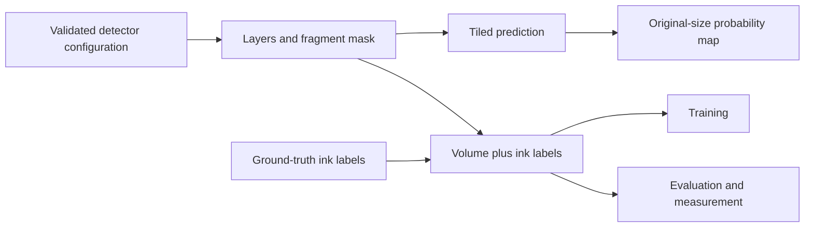

# Design and architecture review — 2026-10-02

Reviewed the shared detector and spiral workflow entry points at baseline
`bd8b95f7`, following the October 1 review. The product is a research workflow;
this review covers command design, input/output contracts, failure reporting,
and resume behavior.

## Findings and fixes

| Priority | Verified defect | Change |
|---|---|---|
| P1 | Spiral drivers treated any `metrics.json`, including `{}`, `null`, or truncated JSON, as a completed score. | One standard-library validator checks summary/strip pixel counts, consistency, and valid JSON. A coherent zero-ink result remains valid. New attempts require both a successful command and valid output. |
| P1 | Mesh counts could pass for the wrong winding range; the sequence counted every mesh sharing the first digit. | Check exactly one directory for every requested winding. Render work directories reject extra windings. Resume also checks the requested mesh range, and ambiguous fit directories are errors. |
| P1 | The end-to-end sequence exited successfully after missing fits or failed rendering/scoring. Failed fits entered a one-hour mesh wait. | Preserve command status immediately, skip waiting after a failed fit, and return nonzero if any arm fails while continuing later arms. Successful asynchronous fits retain a configurable, bounded readiness wait. |
| P2 | Detector inference required ground-truth ink labels solely to recover the unpadded image shape. | Separate layer/fragment-mask loading from supervised label loading. Prediction uses the original layer shape and works on unlabeled fragments; train/eval still require labels. |
| P2 | The advertised inference CLI was absent, and every command forced the default configuration. | Add `infer` with a NumPy output map and configurable inference batch size. All subcommands accept validated JSON configuration overrides. Unknown fields produce a usage error. |
| P2 | `measure` printed `None` scores and exited zero after one or more target failures. | Keep the partial report, print each failed target and error to stderr, and exit nonzero. |
| P2 | A fragment with no usable inference windows silently produced an all-zero prediction. Training could drop every sample or return a nonexistent checkpoint path. | Fail with actionable errors for empty inference coverage, an oversized training batch, and training that produces no checkpoint. |

## Architecture and design

The detector now has separate input contracts for prediction and supervision:

`read_image_mask` retains its public return contract. The new `read_volume_mask`
shares the same clipping and padding, so prediction does not require synthetic
labels and training preprocessing is unchanged. CLI configuration makes the
architecture and input location explicit; users must supply the settings that
match the checkpoint.

The spiral drivers retain their shell orchestration and frozen snapshots, but
share artifact semantics through `repro/spiral_render/artifacts.py`. This avoids
four different interpretations of “scored” without adding a framework or runtime
dependency. A newly executed stage needs both successful process status and
coherent output. A resumed arm must also contain the requested winding set.

The review preserves the trained model structure, loss functions, normalization,
sampling stride, full-window mask rule, and scientific metric calculations.
Published research artifacts, checkpoints, dependency versions, and the villa
submodule were not modified.

## Verification

The initial **14 regression cases failed before the fixes**, demonstrating the
unlabeled-inference error, false success statuses, invalid completion artifacts,
incorrect mesh selection, and failed-fit wait. All 14 passed after the fixes.

- The detector/spiral integration suite passed **109 tests** on CPU, including
  TimeSformer and ResEnc training and checkpoint reload, batching equivalence,
  metrics, data conversion, label-free prediction, and local shell stand-ins:
  `OMP_NUM_THREADS=2 MKL_NUM_THREADS=2 MPLCONFIGDIR=/tmp/vesuvius-matplotlib .venv/bin/python -m pytest -q tests/test_detector_*.py tests/test_spiral_artifacts.py tests/test_spiral_driver_failures.py tests/test_run_render_slice_guard.py tests/test_preflight_accepts_a_submodule.py tests/test_sota_convert.py tests/test_sota_distill_prep.py`.
- After strengthening resume checks, the standard validation runner passed
  **79 tests, with 1 skipped** (the opt-in live S3 check). It now includes the
  shared artifact validator regressions.

- The final checkpoint-contract checks passed **5 tests**, including short
  training runs for both architectures and the missing-checkpoint regression:
  `.venv/bin/python -m pytest -q tests/test_detector_train.py tests/test_detector_train_resenc.py`.
- `scripts/smoke_test.py`: **8 passed, 3 skipped, 0 failed**. The existing
  checkpoint loaded all 288 compatible tensors. Skips require two unavailable
  training-data fixtures and the unavailable upstream augmentation pipeline.
- The nine-file documentation guard suite from `.pre-commit-config.yaml`:
  **92 passed, 1 skipped**. The skip requires an external render artifact.
- Python compilation, shell syntax checks, and `git diff --check` passed.

These suites overlap; their counts are not additive. Smoke and training checks
used the same CPU/thread settings as the integration command above.

## Limits

Tests use synthetic fragments on CPU and tiny local substitutes for external
fit/render/score processes. No live GPU training, multi-hour render, scorer
container, or real OOM recovery was run. These changes establish workflow
correctness; they do not establish improved model accuracy or throughput.

The existing-slice guard continues to reject TIFF reuse during retries. A failed
attempt that leaves slices needs deliberate recovery as documented in the spiral
README. The drivers do not silently delete or reuse research outputs.

The existing mask/stride policy can leave uncovered boundary pixels at zero;
only the entirely empty prediction case now fails. Changing sampling or score
denominators would require a separate scientific comparison. Completed-artifact
checks verify schema and mesh identity, not cryptographic linkage between scores
and mesh contents. Keep work directories immutable once scored and use a fixed
villa revision for a study.
