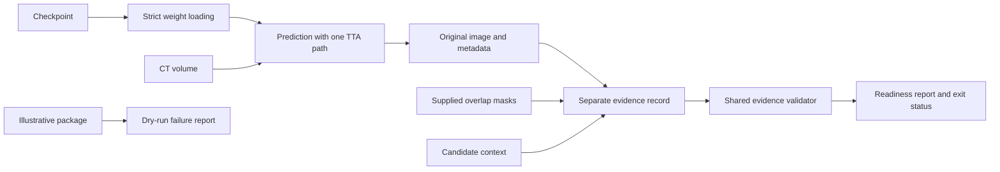

# Design and architecture review — 2026-10-04

Reviewed baseline `1c9210e9`, after the prior workflow and production-prediction
repairs. This review concentrates on the remaining prediction-to-submission
workflow: command execution, model loading, spatial calibration, evidence
assembly, and readiness reporting. The product is a research CLI workflow.

## Findings and repairs

| Priority | Verified defect | Repair |
|---|---|---|
| P1 | Single and ensemble inference tolerated incomplete weights. An empty dictionary skipped zero tensors and could generate apparently successful prediction artifacts with an untrained model. | Use strict checkpoint loading before reading the volume. Empty and incompatible weights fail. The existing best checkpoint still loads all 288 tensors. The explicit partial-loading helper remains available for warm starts. |
| P1 | Default prediction wrapped the model in upstream TTA and then performed manual mirroring again. The wrapper rejected the head-selection arguments used by prediction. | Use the existing four-mirror path once, keeping ink, fiber, and quality outputs together. Both default and disabled-TTA execution are tested against a real local volume and saved weights. |
| P2 | Importing the local Gaussian blender imported optional upstream models and failed because `nrrd` was unavailable, even with TTA disabled. | Defer upstream TTA imports until the separate upstream wrapper is actually invoked. Local blending no longer imports upstream packages or changes `sys.path`. |
| P1 | Readiness returned `PASS` without training/prediction masks or a discovery image; an empty prediction mask could also pass. | Require a readable image and supplied, finite, nonempty 2D masks with matching shapes and at least one selected prediction pixel. Missing evidence is a failure, not a warning. |
| P1 | The evidence chain manufactured a zero training mask and full prediction mask, overwrote geometry with queue values, and cleared placeholder/dry-run flags. | Require supplied masks, preserve original prediction metadata, and write a separate evidence record. Shared validation checks candidate/image identity and rejects disagreements without replacing prediction facts. |
| P1 | A package with illustrative masks became “real prediction” evidence merely by supplying a real image and a non-dry-run scroll name. Its mitigation note claimed guaranteed non-overlap and hallucination elimination and cited the withdrawn skeleton gate. | Always identify the generated package as dry-run and its masks as illustrative. Generate a factual template describing the missing evidence. Report `FAIL` and exit 1. |
| P2 | A failed chain could leave an earlier `PASS` report, and a successful command could reuse stale image/metadata files. | Invalidate the previous readiness result before execution. A successful command must refresh both artifacts. Review commands validate the separate evidence record. |
| P1 | Zero/negative/fractional windows, malformed positions, or inconsistent declared/checkpoint windows could satisfy the window gate. Bad JSON, masks, or nested export metadata could crash instead of producing a report. | Validate positive finite geometry, x/y/z voxel indices, and coherent ML-window declarations. Malformed inputs produce finite JSON failure reports; CLI report directories are created automatically. The existing 64-pixel-or-0.5-mm rule is retained. |
| P2 | VC3D validation checked file existence but missed inconsistent shapes, absent OME metadata, malformed axes/scales, and mismatched VC3D voxel size. Metadata-relative paths depended on the caller's directory. | Validate the v2 group, single uint8 slice, dimensions, voxel size, z/y/x spatial axes, scales, and declared origin translation. Resolve metadata-relative paths and retain existing legacy CWD-relative paths as a fallback. New writers record absolute artifact paths. |
| P2 | PNGs displayed a millimeter bar while declaring a centimeter bar; small bars extended outside the crop. Checkpoint voxel size could disagree between JSON metadata and exports. | Choose a physical bar that fits, derive its declaration from the same helper, and use checkpoint voxel size consistently. Exports without a discovery image declare no image or centimeter bar. |
| P2 | Ranked commands and the README referenced moved launcher paths. Direct prediction could not import repository modules outside the checkout. | Generate the absolute existing prediction launcher, bootstrap its repository imports for direct execution, reject malformed candidate geometry/stems, and document the current module command. |

## Architecture and operator design

The existing model factory, normalized loader, and separate research/evaluation
contracts are useful foundations. The defect in submission assembly was treating
queue annotations and illustrative output as substitutes for observed evidence.
The repaired boundary is explicit:

Inference preflight and submission readiness have different purposes. Preflight
now labels its scope as inference prerequisites; it does not certify missing
submission evidence. Original prediction metadata is retained for audit, and the
review manifest points to the enriched evidence record. A historical local
fixture that previously passed without masks is now correctly rejected; its
historical files were not rewritten.

The updated README and [submission guide](SUBMISSION_EVIDENCE.md) describe the
commands, required inputs, failure statuses, path rules, and preview behavior.
No published research report, checkpoint, preregistration, dependency version,
or villa submodule was changed. These repairs make no new accuracy claim.

## Verification

The initial submission regression suite reproduced **34 failures and 5 passes**
before fixes. Four later checkpoint cases reproduced successful artifact creation
from incomplete weights. A local-volume integration test also reproduced the
optional-upstream import failure before the dependency boundary was repaired.

- Standard validation:
  `OMP_NUM_THREADS=2 MKL_NUM_THREADS=2 MPLCONFIGDIR=/tmp/vesuvius-matplotlib .venv/bin/python scripts/run_validation_tests.py`
  — **176 passed, 1 skipped** in 13.17 s. The skip is opt-in live S3. The runner
  now includes the submission regressions, and earlier production,
  orchestration, interpolation, and export contracts remain covered.
- Related review-manifest, post-sprint handoff, worklist, preflight-summary, and
  action-matrix tests: **14 passed**:
  `OMP_NUM_THREADS=2 MKL_NUM_THREADS=2 MPLCONFIGDIR=/tmp/vesuvius-matplotlib .venv/bin/python -m pytest -q tests/test_villa_review_manifest.py tests/test_post_sprint_villa_handoff.py tests/test_lasagna_fiber_worklist.py tests/test_summarize_villa_evidence_preflight.py tests/test_villa_prize_action_matrix.py --tb=short`.
- Smoke checks:
  `OMP_NUM_THREADS=2 MKL_NUM_THREADS=2 MPLCONFIGDIR=/tmp/vesuvius-matplotlib .venv/bin/python scripts/smoke_test.py`
  — **8 passed, 3 skipped, 0 failed**. Skips require two unavailable training
  fixtures and an unavailable upstream augmentation pipeline.
- The nine documentation guards from `.pre-commit-config.yaml`, plus the October
  filing-number guard, passed **102 tests, 1 skipped**. The skip requires an
  external render artifact.
- Ruff 0.9.10 lint and formatting checks pass for all **14 changed Python files**.
  `git diff --check` passes. Full model loading of `best_model.pt` with the shared
  prediction factory and `strict=True` passed for **288 tensors**.
- Repository-wide mypy 1.19.1:
  `UV_CACHE_DIR=/workspace/.cache/uv UV_TOOL_DIR=/workspace/.cache/uv-tools uv tool run --offline --from mypy==1.19.1 mypy . --explicit-package-bases --namespace-packages --python-executable .venv/bin/python`
  — **17 existing errors in 14 files**, checking 579 source files. Diagnostics
  match the prior baseline: missing requests/YAML stubs and existing OpenCV,
  NumPy, optional-tensor, and teacher-logit annotations. This gate does not pass;
  no new diagnostics were introduced.

## Limits

Tests use CPU, local synthetic volumes, readable image fixtures, real local Zarr
exports, and saved weights. There was no live GPU training, full-volume inference,
live S3, long render, scorer container, or prize submission. The independent
fragment detector's scientific sampling and metric definitions are unchanged.

Readiness checks validate supplied declarations and files. They cannot prove that
masks describe all training data, that apparent letters are ink, or that a drawn
bar is physically calibrated. They do not scan all Zarr chunk payloads. Artifact
refresh checks use file metadata rather than cryptographic run attestations.
The optional upstream TTA wrapper still requires its own upstream dependencies
when explicitly used; ordinary prediction uses the local mirroring path.

This review addresses the shared submission workflow and its prediction producer;
it does not revalidate every historical experiment script or archived plan.
