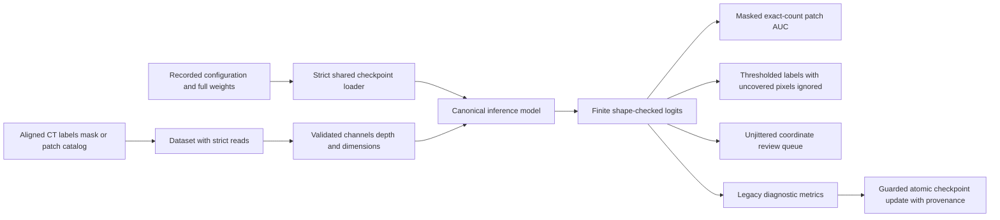

# Design and architecture review — checkpoint tools, 2026-10-04

Reviewed baseline `31896a8e`, including the merged CT-inference review and current
main's fixture repairs. This pass covers checkpoint re-evaluation, patch AUC,
pseudo-label generation, and active-learning queues. The design surface is the
research CLI and its handoff to manual reviewers.

## Findings and repairs

| Priority | Verified defect | Repair |
|---|---|---|
| P1 | Re-evaluation reconstructed a saved architecture using the current experiment's dimensions/channels, then accepted partial compatible weights. AUC and pseudo-labeling also accepted partial weights. | Shared recorded-setting validation and strict full-weight loading before dataset access. |
| P1 | Auxiliary tools mixed current `config.json` ridge settings with checkpoint inputs; AUC and pseudo-labeling depended on an unrelated working-directory config. | Checkpoint-authoritative channel/head/ridge settings; explicit optional cache path for standalone AUC/pseudo-labeling. |
| P1 | Active-learning returned catalog positions even though the dataset jittered the patches spatially. Existing sampler checks missed custom reordered batches. | Disable jitter in the CLI, reject jittered/reordered public-loader calls, and track actual cumulative batch offsets. |
| P1 | AUC scored pixels outside the fragment mask, exceeded requested sample counts at batch boundaries, and exited successfully with no usable patches. | Score aligned binary labels only inside the mask, stop at exactly the requested count, and report failed/insufficient fragments with nonzero command status. |
| P1 | Nonfinite logits could become ordinary sigmoid probabilities; head dimensions and short buffered inputs were unchecked. | Shared finite input/target/logit checks with exact channels, depth, batch count, and spatial dimensions. |
| P1 | Labeled dataset read failures silently became zero CT/labels, allowing auxiliary inference to create labels or review scores for failed reads. | Opt-in strict read mode for all four analysis tools. Training fallback is preserved. |
| P2 | Invalid or reversed pseudo-label thresholds and invalid/misaligned maps generated plausible three-value labels. | Validate ordered finite thresholds, aligned boolean region masks, probability range, bounds, and covered requested pixels before saving. |
| P1 | Empty re-evaluation exited successfully; swallowed metric errors could become zero/NaN stored metrics. Direct checkpoint replacement risked interruption while writing. | Fail incomplete/nonfinite measurements, preserve the checkpoint on error, and atomically replace only after successful explicit update with evaluation provenance. |
| P2 | Zero/negative active queue sizes returned surprising results, empty datasets failed incidentally, requested catalogs could be ignored, and bare output names failed parent creation. | Positive queue limits, explicit empty/catalog failures, deterministic large-catalog sampling, and valid output-parent handling. |

## Architecture and operator design

`src/vesuvius_autoresearch/core/checkpoint_tools.py` provides a small boundary for
strict checkpoint loading, buffered input validation, ink probabilities, and
target/output validation. It calls the existing canonical model factory rather
than importing training just to reconstruct inference models. AUC and
pseudo-label generation no longer import the training entry point or read its
current experiment configuration. Re-evaluation still uses training's legacy
metric formulas and current validation URI/batch size.



The [operator guide](CHECKPOINT_ANALYSIS.md) states checkpoint requirements,
sampling context, exact-count versus queue-limit semantics, output meaning,
failure status, and the distinction between legacy diagnostics and current model
promotion. Existing probability formulas, uncertainty weights, and diagnostic
metric formulas are preserved. Corrected masking, coordinate alignment, sigma,
and sample counts intentionally affect future auxiliary results.

## Verification

The initial behavioral regressions reproduced **22 failures**. The final new
module has **47 cases**, including actual local-Zarr and real small ResEnc
pseudo-label inference; checkpoint drift, complete weights, masked/exact AUC,
nonfinite/wrong-shaped heads, jitter/count errors, thresholds, strict/default
read behavior, and failed/successful checkpoint-update preservation.

```sh
OMP_NUM_THREADS=2 MKL_NUM_THREADS=2 MPLCONFIGDIR=/tmp/vesuvius-matplotlib .venv/bin/python scripts/run_validation_tests.py
```

```text
370 passed, 1 skipped, 9 warnings in 29.39s
```

New tests and existing active-learning/pseudo-label tests are included in standard
validation. Other suites exercise detector, CT inference, submission evidence,
orchestration, exports, and metrics. The skip is the opt-in live S3 check; warnings
concern CPU pinning. Counts from separate suites are not additive.

```sh
OMP_NUM_THREADS=2 MKL_NUM_THREADS=2 MPLCONFIGDIR=/tmp/vesuvius-matplotlib .venv/bin/python scripts/smoke_test.py
```

```text
8/11 passed, 3 skipped, 0 failed in 6.4s
```

Available model/checkpoint paths pass; the skips require absent training data or
the optional upstream augmentation pipeline.

```sh
OMP_NUM_THREADS=2 MKL_NUM_THREADS=2 MPLCONFIGDIR=/tmp/vesuvius-matplotlib .venv/bin/python -m pytest tests/test_audit_doc_references.py tests/test_audit_report_claims.py tests/test_withdrawn_claims_stay_withdrawn.py tests/test_arm_tiers.py tests/test_audit_arm_coverage.py tests/test_analyse_flat_displacement.py tests/test_quotations_match_source.py tests/test_analyse_pooled_fit_only_floor.py tests/test_analyse_ink_maximum_offset.py tests/test_filing_2026_10_numbers.py -q --no-header --tb=short
```

```text
103 passed, 1 skipped in 9.23s
```

The documentation, claim and filing guards pass; the skip requires an external
render artifact. New document citations and README/guide/review Markdown links
resolve. Ruff 0.9.10 check and format-check pass for all eight changed Python
files (`All checks passed!`; `8 files already formatted`). These use
`UV_CACHE_DIR=/workspace/.cache/uv UV_TOOL_DIR=/workspace/.cache/uv-tools uv tool run --offline --from ruff==0.9.10`
followed by `ruff check` or `ruff format --check` and those file paths.
Compilation, changed-file whitespace/final-newline checks, and `git diff --check`
pass.

```sh
UV_CACHE_DIR=/workspace/.cache/uv UV_TOOL_DIR=/workspace/.cache/uv-tools uv tool run --offline --from mypy==1.19.1 mypy . --explicit-package-bases --namespace-packages --python-executable .venv/bin/python
```

```text
Found 17 errors in 14 files (checked 596 source files)
```

Typing retains the existing missing requests/YAML stubs, OpenCV/NumPy, loader
optional-tensor, and teacher-logit diagnostics. Two existing annotations are in
the modified loader; no new diagnostic was introduced. This is a failing gate.

## Limits

Verification uses CPU, local synthetic arrays/checkpoints, and a real small
ResEnc backbone. No live GPU, full real-scroll run, new accuracy experiment,
published measurement regeneration, or prize submission occurred. Current
research configuration, best checkpoint, study scripts, artifacts, preregistrations,
and upstream villa were untouched.

Patch AUC remains label-conditioned and can include overlapping patches; it is
not a full-fragment held-out score. Buffered z sampling, training fallbacks, and
ridge GPU/CPU/zero fallback remain existing recipes. Queue scores do not validate
accuracy or reviewer outcomes. Legacy Dice/topology re-evaluation does not
refresh F1/AP promotion fields. Model settings and evaluation provenance cannot
attest to dataset independence or annotation quality.
