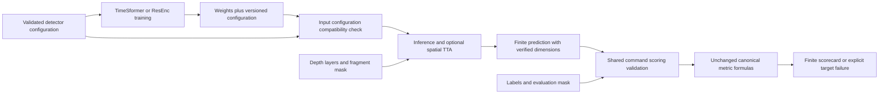

# Design and architecture review — detector contracts, 2026-10-04

Reviewed baseline `ff47162f`, after the submission-workflow review was merged.
This pass concentrates on the independent fragment detector's configuration,
training, checkpoint loading, prediction, and evaluation commands. The product
is a research CLI workflow; there is no browser interface to assess here.

## Findings and repairs

| Priority | Verified defect | Repair |
|---|---|---|
| P2 | `weight_decay`, `max_grad_norm`, and `warmup_factor` advertised settings that execution ignored in both architectures. | Pass the values to AdamW, Lightning clipping, and the warmup scheduler. Change defaults to the previously executed 0.01, 1.0, and 1.0, preserving the default recipe. Explicit overrides now take effect. |
| P1 | Detector checkpoints recorded weights without their input configuration. Compatible tensors could load while reading a different depth interval; ResEnc weights could also load for a different lateral window. | Both models share a versioned configuration checkpoint hook. Reject incompatible model/input settings before reading fragment data. Legacy files retain explicit caller configuration and emit a warning; malformed recorded configurations fail. |
| P2 | `use_tta=true` made no change to prediction. | Evaluate four spatial mirror views, undo each output mirror, then average probabilities. Default false retains one forward. No depth reversal or new accuracy claim is introduced. |
| P1 | Nonfinite logits were exported, wrong channel counts silently discarded channels, and short output batches were truncated by `zip`. | Require finite floating-point logits with the exact batch count and one channel; use strict accumulation pairing. Invalid output fails before the CLI writes its map. |
| P2 | Fractional/boolean indices, invalid architecture types, invalid optimizer/loss settings, nonfinite calibration, and string fragment lists passed validation or failed later with unrelated errors. | Validate types and ranges before model construction or data reads; bad JSON overrides produce a CLI usage error. |
| P1 | Empty or single-class evaluation masks generated NaN scorecards. Cross-scroll measurement printed NaN and exited zero; NaN labels were silently thresholded into background. | A shared command-level scoring boundary validates arrays and rejects degenerate samples. Evaluation validates before replacing artifacts; measurement records target failures in its partial report and exits nonzero. JSON writers reject NaN/Inf. |
| P2 | The reproduction AUC gate used an `assert`, so `python -O` removed it and accepted a below-target result. | Raise the same assertion error explicitly. A fresh optimized interpreter verifies enforcement. |

## Architecture and operator design

Configuration now describes execution rather than inherited, unused constants.
The README and [detector workflow guide](DETECTOR_WORKFLOW.md) explain checkpoint
compatibility, effective settings, optional TTA, and failed measurements. An
existing JSON file containing the formerly advertised training values now
actually applies them; the guide identifies the values needed to retain previous
execution behavior.

Two small shared modules enforce the relevant boundaries without introducing a
framework or changing the architecture implementations:



`checkpoint.py` supplies the save/load contract to both Lightning models.
Inference compatibility concerns architecture, lateral window, and depth
selection; paths, target names, optimization settings, stride, and TTA remain
caller choices. Recorded configuration is not an attestation of training data.

`scoring.py` wraps the canonical metric module at the evaluation/measurement
boundary. The canonical `metrics.py` is unchanged, preserving its formulas,
threshold sweep, denominator, and low-level degenerate NaN diagnostics. Valid
measurements retain their numerical definitions. The existing stride, padding,
full-window mask rule, and uncovered-pixel policy are also unchanged.

## Verification

The first behavioral regression run reproduced **41 failures and 4 passes**.
The optimized-interpreter gate test separately reproduced a successful exit for
a below-target AUC before its repair. The final regression module has **52 cases**
and is included in standard validation. Suites below overlap; counts are not
additive.

### Standard validation

```sh
OMP_NUM_THREADS=2 MKL_NUM_THREADS=2 MPLCONFIGDIR=/tmp/vesuvius-matplotlib .venv/bin/python scripts/run_validation_tests.py
```

```text
228 passed, 1 skipped in 30.38s
```

All new detector regressions and existing submission, production prediction,
interpolation, orchestration, export, and metric-integration checks pass. The
skip is the opt-in live S3 check. TTA tests check input transforms, inverse
orientation, overlapping output, and full/final-partial batches. Checkpoint
tests save and reload real small ResEnc weights, reject same-shape mismatches,
and exercise legacy and malformed records.

### Detector integration

```sh
OMP_NUM_THREADS=2 MKL_NUM_THREADS=2 MPLCONFIGDIR=/tmp/vesuvius-matplotlib .venv/bin/python -m pytest -q tests/test_detector_*.py tests/test_metrics_contract_sync.py --tb=short
```

```text
103 passed, 2 skipped, 21 warnings in 167.26s (0:02:47)
```

Both real architectures train briefly on synthetic fragments and reload their
checkpoints; tests verify saved configuration, batching parity, normalization,
losses, labels, and scorecards. This run preceded adding the optimized-gate
regression, which passes in final standard validation. The two skips require a
sibling ScrollGT checkout. Its source comparison was unavailable; the local
canonical metric module has no diff. Warnings concern CPU pinning, workers,
logging intervals, and temporary checkpoint directories.

### Smoke checks

```sh
OMP_NUM_THREADS=2 MKL_NUM_THREADS=2 MPLCONFIGDIR=/tmp/vesuvius-matplotlib .venv/bin/python scripts/smoke_test.py
```

```text
Loaded 288/288 compatible tensors from best_model.pt (skipped missing=0, shape=0).
--- 8/11 passed, 3 skipped, 0 failed in 16.4s ---
```

Available research-model checks pass. Two unavailable training fixtures and the
optional upstream augmentation pipeline remain skipped.

### Documentation guards

```sh
OMP_NUM_THREADS=2 MKL_NUM_THREADS=2 MPLCONFIGDIR=/tmp/vesuvius-matplotlib .venv/bin/python -m pytest tests/test_audit_doc_references.py tests/test_audit_report_claims.py tests/test_withdrawn_claims_stay_withdrawn.py tests/test_arm_tiers.py tests/test_audit_arm_coverage.py tests/test_analyse_flat_displacement.py tests/test_quotations_match_source.py tests/test_analyse_pooled_fit_only_floor.py tests/test_analyse_ink_maximum_offset.py tests/test_filing_2026_10_numbers.py -q --no-header
```

```text
102 passed, 1 skipped in 16.40s
```

The reference, claim, and filing guards pass; the skip requires an external
render artifact. New documentation references are also checked before handoff.

### Lint, formatting, and typing

Ruff 0.9.10 check and format-check pass for all **14 changed Python files**:
`All checks passed!` and `14 files already formatted`. These use
`UV_CACHE_DIR=/workspace/.cache/uv UV_TOOL_DIR=/workspace/.cache/uv-tools uv tool run --offline --from ruff==0.9.10`
followed by `ruff check` or `ruff format --check` and the changed Python paths.
Python compilation and `git diff --check` also pass.

```sh
UV_CACHE_DIR=/workspace/.cache/uv UV_TOOL_DIR=/workspace/.cache/uv-tools uv tool run --offline --from mypy==1.19.1 mypy . --explicit-package-bases --namespace-packages --python-executable .venv/bin/python
```

```text
Found 17 errors in 14 files (checked 582 source files)
```

Repository-wide typing still fails with the prior baseline diagnostics: missing
requests/YAML stubs and existing OpenCV, NumPy, optional-tensor, and teacher-logit
annotations. No diagnostic concerns a changed file. This is not a passing gate.

## Limits

Tests use CPU, synthetic fragments, small local checkpoints, and local executable
fixtures. No live GPU training, full real-fragment inference, live S3, rendering
container, prize submission, or real-scroll accuracy experiment was performed.
The repairs establish software contracts, not an accuracy or throughput gain.

Legacy checkpoints lack input provenance, and recorded configuration cannot
verify dataset history. Prediction still accumulates dense arrays in memory and
can leave uncovered pixels at zero under the existing mask/stride policy.
Invalid evaluation leaves previous artifacts intact; callers must honor failure
status rather than treating a previous file as the new result.

No published research report, preregistration, existing checkpoint, dependency
version, or villa submodule was modified. The earlier workflow review remains
covered by standard validation; this pass does not execute every historical
experiment script.
