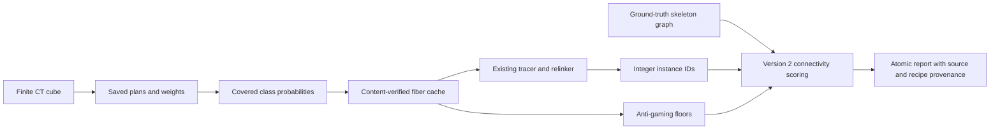

# Design and architecture review: fiber inference and connectivity scoring

Reviewed the fiber workflow from the merged `9256efc1` tree on 2026-10-04.
Earlier reviews cover experiment lifecycle, fragment detectors, CT-volume
inference, checkpoint analysis, and submission evidence. This pass follows the
remaining standalone fiber path: classical filters, semantic-model inference,
probability caches, cube downloads, connectivity scoring, and benchmark reports.

## Findings and repairs

| Priority | Confirmed problem | Repair |
| --- | --- | --- |
| P1 | ERL concatenated samples in arbitrary NML edge order. Shuffling/reversing edges changed a score for identical geometry and could join disconnected runs. | Score connected same-label arclength components on the actual skeleton graph. Canonicalize edge sampling and include terminal nodes in the precision reference. Version the corrected scorer as 2. |
| P1 | Probability caches were accepted solely by volume shape, even after changing the CT image, model weights, plans, or patch size. | Verify content hashes, inference settings, and output checksum through a sidecar manifest. Recompute corrupt, stale, and unattested caches; reject inputs that change during inference. |
| P1 | All-cube floor refreshes copied old tracer rows into a new report regardless of tolerance, probability mask, model, or skeleton. | Carry a tracer row only when complete per-cube provenance matches, including the scoring version. |
| P1 | Nonfinite or malformed semantic logits could become exported probabilities; oversized tile steps could leave uncovered voxels. | Validate finite input, exact logits, positive patch/stride geometry, tile step in `(0, 1]`, mirror axes, and full blend coverage. Validate normalized class probabilities before collapsing to fiber probability. |
| P1 | The semantic loader silently applied its own single-channel Z-score recipe to incompatible plans and broadly ignored unexpected decoder-head keys. | Require the supported recorded normalization, input channel, class IDs, and patch divisibility. Preserve supplied class names. Allow only auxiliary deep-supervision weight/bias keys; reject missing inference weights and other unexpected keys. |
| P2 | Importable CuPy was treated as proof of a usable GPU. The CLI failed on CPU machines with CuPy installed. | Add explicit device selection and automatic availability checks. CPU selection avoids CUDA probing; unavailable CUDA falls back only in automatic mode. Allocation/filter failures remain failures. |
| P2 | Integer CT smoothing retained integer dtype, causing in-place normalization errors; tiled output could truncate probabilities. Insufficient halos introduced tile seams. | Convert integer/small-float CT to float32 and require finite 3D input, valid filter scales, positive blocks, and a halo covering Gaussian support plus two derivatives. |
| P2 | The score command narrowed instance IDs to int32, turning large IDs into background or aliasing different fibers. Float, negative, and boolean labels were accepted by the scoring API. | Preserve integer widths and reject invalid labels and nonfinite/invalid scoring geometry. |
| P2 | Fetching a requested cube could also match identical coordinates in another scroll; interrupted downloads left a nonempty partial file that a later fetch would reuse. | Match the entire cube identity, download to temporary files with socket timeouts, check supplied byte counts, and publish only successful transfers. |
| P2 | Single-cube JSON lacked source identity, requested floors were omitted from saved score reports, and interrupted report writes could replace prior evidence. | Write versioned provenance with rows, retain requested floor rows, record full tracer/relink settings, and atomically replace finite JSON reports. Create requested output parents. |

The first 45 regression cases produced **42 failures and 3 passes** on the
original implementation. The completed regression module contains **75 cases**.
They exercise real saved toy-network weights, CPU inference/filtering, actual
masked-CUDA CLI subprocesses, graph scoring, cache changes, report preservation,
and interrupted-download behavior without real research data or network access.

## Architecture and operator design

The workflow retains its existing modules and model recipe. The new
`src/vesuvius_autoresearch/fibers/provenance.py` owns content identity, artifact
versions, and atomic writes used by the benchmark. Semantic plans/weights remain
the responsibility of `semantic.py`; classical NumPy/CuPy dispatch remains in
`detection.py`; connectivity belongs to `eval_trace.py`; the CLI coordinates these
boundaries. The scorer does not need a learned model to score supplied instances.



ERL still uses `sum(L²) / sum(L)`, with merge-penalized ERL, coverage, splits,
merges, and tolerance reported separately. The correction changes how connected
runs are identified: same-label intervals join through an actual shared node,
and disconnected graph components stay separate. Branch components use their
total connected arclength. The precision reference now includes edge terminal
nodes. Edge and node serialization do not change the score.

**This is a measurement correction, not a demonstrated tracer improvement.**
Published fiber results and rankings were generated with the legacy scorer and
must be recomputed before use as version-2 evidence. The workflow guide,
README, FINDINGS, and the two historical measurement reports now disclose this.
Their numerical tables and the historical all-cube JSON have not been rewritten.
The separate ScrollGT repository has not been changed.

The benchmark now chooses CUDA or CPU explicitly, caches by the actual device and
precision, and exposes source/recipe identity in reports. Hashing the checkpoint
adds I/O on cache checks; correctness takes priority over trusting a filename.
Existing model files must remain available even for cache hits. Legacy caches
without manifests are recomputed. A cache's two files are replaced separately;
the checksum makes an interrupted or interleaved pair fail validation on reuse.

Single-cube report consumers must read the `rows` member of the new object.
All-cube reports retain `cubes`, with per-cube provenance. The operator contracts
and migration notes are in [fiber tracing](FIBER_TRACING.md) and
[fiber detection](FIBER_DETECTION.md).

## Verification

These suites overlap; their counts should not be added together.

Standard validation:

```bash
OMP_NUM_THREADS=2 MKL_NUM_THREADS=2 MPLCONFIGDIR=/tmp/vesuvius-matplotlib .venv/bin/python scripts/run_validation_tests.py
```

**463 passed, 3 skipped, 9 warnings in 31.33 seconds.** The skips are the two
optional CUDA fiber checks and the optional live S3 test. Warnings concern CPU
data-loader pinning. The new 75-case module, classical fiber checks, CLI checks,
and connectivity invariants are now included in the standard runner.

Broader fiber suite:

```bash
OMP_NUM_THREADS=2 MKL_NUM_THREADS=2 MPLCONFIGDIR=/tmp/vesuvius-matplotlib .venv/bin/python -m pytest tests/test_fiber_workflow_contracts.py tests/test_fibers.py tests/test_fibers_cli.py tests/test_fiber_eval_trace.py tests/test_fiber_trace.py tests/test_fiber_trace_baseline.py tests/test_fiber_orientation.py tests/test_fiber_relink.py tests/test_fiber_skeleton_io.py tests/test_field_quality.py -q --tb=short
```

**195 passed, 6 skipped in 13.31 seconds.** Four skips need real skeleton/semantic
cube files; two require a visible GPU. The suite includes oracle and anti-gaming
floors, graph/label invariants, synthetic tracing, relinking, orientation, and
field-quality checks.

Smoke checks:

```bash
OMP_NUM_THREADS=2 MKL_NUM_THREADS=2 MPLCONFIGDIR=/tmp/vesuvius-matplotlib .venv/bin/python scripts/smoke_test.py
```

**8 of 11 passed, 3 skipped, 0 failed in 16.9 seconds.** The skips require absent
training data or an optional upstream augmentation API. This checks imports,
model construction, existing checkpoint loading, and research-loop templates.

Documentation guards:

```bash
OMP_NUM_THREADS=2 MKL_NUM_THREADS=2 MPLCONFIGDIR=/tmp/vesuvius-matplotlib .venv/bin/python -m pytest tests/test_audit_doc_references.py tests/test_audit_report_claims.py tests/test_withdrawn_claims_stay_withdrawn.py tests/test_arm_tiers.py tests/test_audit_arm_coverage.py tests/test_analyse_flat_displacement.py tests/test_quotations_match_source.py tests/test_analyse_pooled_fit_only_floor.py tests/test_analyse_ink_maximum_offset.py tests/test_filing_2026_10_numbers.py -q --no-header --tb=short
```

**103 passed, 1 skipped.** The skip needs an absent external render artifact.

Ruff 0.9.10 check and format-check pass for all eight changed Python files:
`cli.py`, `detection.py`, `eval_trace.py`, `semantic.py`, `bench_cli.py`, and
`provenance.py` under `src/vesuvius_autoresearch/fibers/`, plus
`tests/test_fiber_workflow_contracts.py` and `scripts/run_validation_tests.py`.
Python compilation and `git diff --check` also pass.

Repository typing:

```bash
UV_CACHE_DIR=/workspace/.cache/uv UV_TOOL_DIR=/workspace/.cache/uv-tools uv tool run --offline --from mypy==1.19.1 mypy . --explicit-package-bases --namespace-packages --python-executable .venv/bin/python
```

The gate still fails with **17 pre-existing errors in 14 files**, checking 599
source files. These concern Requests/YAML stubs, OpenCV/NumPy annotations,
augmentation slice types, teacher-logit annotations, and optional tensors in the
training loader. No typing diagnostics remain in this review's changed files.

## Limits

- This environment has no usable GPU, published semantic checkpoint, or real
  fiber cubes. CUDA parity and real-cube cases are optional skips. Full model
  memory use, GPU AMP/TTA accuracy, and real-cube scorer comparisons remain
  unverified here.
- No live dataset download was performed. Interrupted-transfer and scroll
  selection tests use a controlled HTTP-source substitute. Existing nonempty
  downloads from earlier versions remain reused; previously interrupted files
  should be removed and fetched again.
- No research experiment was run, no model was trained, and no gain in reading
  accuracy or tracing performance is claimed. The tracer, relinker, and their
  default parameters remain the published recipes.
- The supported semantic input is one CT channel with unmasked Z-score
  normalization and mutually exclusive classes with background zero. Multi-input,
  masked-normalization, ignore-label, and region-label nnUNet models are rejected.
- Standard validation covers earlier reviewed workflows, but this pass does not
  execute every historical analysis script or change upstream villa code.

## Addendum, same day: scoring version 3

Version 2 skipped zero-length edges without joining their endpoints, so a fiber traced through a duplicate node
split there on every labelling, the oracle included. WEBKNOSSOS traces contain such edges: 821 of 87,469 across
ScrollGT's eleven fiber cubes, and 663 of 3,124 in `s1_10997_02997_02997_256`. On that cube version 2 scored the
oracle at ERL 166.86 with 512 splits; version 3 gives 244.20 with 11 splits. Version 3 merges the endpoints of
zero-length edges before attaching runs. `test_graph_scoring_keeps_a_fiber_connected_through_a_zero_length_edge`
fails on version 2 and passes on version 3. `SCORING_VERSION` is 3.
