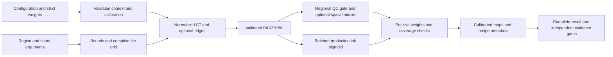

# Design and architecture review — CT inference, 2026-10-04

Reviewed baseline `d1476237`, after the detector-contract review was merged.
This pass examines the local CT-volume single-model, ensemble, and batched
production entry points, their model/loader boundaries, exports, and submission
readiness. The operator interface is a research CLI; no browser interface is
present in this workflow.

## Findings and repairs

| Priority | Verified defect | Repair |
|---|---|---|
| P1 | CT-only ensemble input was four-dimensional when indexed as five-dimensional, so the normal no-ridge path crashed. | A shared input boundary produces and validates B/C/Z/H/W before member-specific channel/depth slicing. |
| P1 | Ensemble members with different lateral patches were combined using top-left input crops and incompatible output sizes; differing calibration or ridge settings were accepted. | Require common patch size and voxel calibration, plus common ridge sigma and maximum depth for ridge-enabled members. Preserve shorter CT-only prefix contexts. Missing members fail instead of silently reducing the ensemble. |
| P1 | Regional grids omitted terminal positions. Hann weights were zero at outer borders; epsilon normalization attenuated small positive Gaussian weights. | Include boundary tiles, use positive Hann weights already used by production, divide by actual weights, and require full coverage for complete results. Constant predictions now remain constant across every requested pixel. |
| P2 | Zero dimensions/stride acted as defaults, undersized explicit regions expanded silently, out-of-bounds regions and invalid/empty shard requests reached inference. | Resolve only omitted values as defaults and validate dimensions, strides, coordinates, depth bounds, and shard assignments before model execution/export. |
| P1 | Checkpoint `ridge_sigma` was ignored by all three loaders. | Validate and pass the effective sigma. Reject ensemble depth combinations that would recompute a shorter member's ridges using a longer context. |
| P1 | Ensemble Zarr exports used default calibration without source/origin metadata; no fiber Zarr or per-member provenance was exported. Custom output locations could leave default metadata in a nonexistent directory. | Reuse calibrated Zarr, fitted scale-bar, and metadata helpers; export both maps beside the overlay, create explicit metadata parents, and record all members plus the applied recipe. |
| P1 | Regional malformed or nonfinite ink/fiber/QC heads could be exported; production sigmoid hid infinite logits as valid probabilities. | Validate finite input tensors and raw logits, exact multitask head dimensions and batch/channel counts. Invalid results fail before export. |
| P1 | Shards printed ordinary completion, lacked blend weights/completeness evidence, and could be presented to submission validation as complete results. | Save weights, coverage and tile counts; label partial completion and reject partial or inconsistent completeness records in readiness validation. |
| P2 | An unknown architecture name silently constructed the default gated model. | Reject unsupported names in the canonical inference factory, before construction. |
| P2 | The positive Gaussian CLI flag actually disabled Gaussian blending because of an implicit boolean-parser action. | Give positive and negative options explicit actions; document the corrected flag behavior. |
| P3 | README onboarding began with a missing `progress.png` teaser. | Remove the broken image reference. |

## Architecture and operator design

`src/vesuvius_autoresearch/core/inference.py` owns shared geometry, input shaping,
Hann weights, blend normalization, and regional multitask probability checks.
The single-model path loads one model once; ensemble inference calls the same
probability function for every member. Production shares geometry/input/blend
utilities while retaining its distinct batched ink-only recipe.



The [operator guide](VOLUME_INFERENCE.md) distinguishes checkpoint families,
recipes, ensemble compatibility, output placement, coordinate units, and partial
results. The README links that guide from CT checkpoint prediction.

Regional QC gating, fiber depth collapse, and the four mirror views retain their
existing formulas. Production remains ungated and has no mirror averaging.
Boundary tiling, positive Hann weights, and removal of epsilon attenuation are
intentional numerical corrections; future regional boundary probabilities can
change. Checkpoint sigma overrides now affect features as configured. These
changes do not establish a model accuracy gain. Published measurements,
preregistrations, checkpoints, and dependencies were not changed.

## Verification

Focused regional/production tests passed **95 cases**. They use real local Zarr
volumes, strict saved checkpoints, synthetic multitask heads, and real small
ResEnc backbones with both dummy and learned heads. Tests compare direct model
probabilities with saved single/ensemble maps, including two-member averaging;
check all-pixel constant predictions under Gaussian/Hann and TTA on/off; verify
inverse mirror orientation, mixed CT/ridge channel/depth inputs, sigma delivery,
physical export transforms, custom directories, invalid preflight settings,
nonfinite heads/CT, explicit shards, and submission rejection.

The new regional regression module contains **85 cases** and is included in
standard validation. Four production cases cover nonfinite logits and sigma.
The suites below overlap, so their counts are not additive.

```sh
OMP_NUM_THREADS=2 MKL_NUM_THREADS=2 MPLCONFIGDIR=/tmp/vesuvius-matplotlib .venv/bin/python scripts/run_validation_tests.py
```

```text
317 passed, 1 skipped in 34.57s
```

The skip is the opt-in live S3 test. Existing detector, submission,
interpolation, orchestration, Zarr/export, and metric-integration checks pass.

```sh
OMP_NUM_THREADS=2 MKL_NUM_THREADS=2 MPLCONFIGDIR=/tmp/vesuvius-matplotlib .venv/bin/python scripts/smoke_test.py
```

```text
Loaded 288/288 compatible tensors from best_model.pt (skipped missing=0, shape=0).
8/11 passed, 3 skipped, 0 failed in 11.4s
```

The skips require unavailable training fixtures or the optional upstream
augmentation pipeline.

The final focused run (including explicit positive/negative blending options)
passed **95 cases in 8.50s**.

```sh
OMP_NUM_THREADS=2 MKL_NUM_THREADS=2 MPLCONFIGDIR=/tmp/vesuvius-matplotlib .venv/bin/python -m pytest tests/test_audit_doc_references.py tests/test_audit_report_claims.py tests/test_withdrawn_claims_stay_withdrawn.py tests/test_arm_tiers.py tests/test_audit_arm_coverage.py tests/test_analyse_flat_displacement.py tests/test_quotations_match_source.py tests/test_analyse_pooled_fit_only_floor.py tests/test_analyse_ink_maximum_offset.py tests/test_filing_2026_10_numbers.py -q --no-header --tb=short
```

```text
103 passed, 1 skipped in 10.84s
```

The skip requires an external render artifact. References in the new guide and
review report resolve. Historical upstream commit citations were preserved;
this checkout does not contain all upstream history.

Ruff 0.9.10 check and format-check pass for all **nine changed Python files**:
`All checks passed!` and `9 files already formatted`. The commands use
`UV_CACHE_DIR=/workspace/.cache/uv UV_TOOL_DIR=/workspace/.cache/uv-tools uv tool run --offline --from ruff==0.9.10`
followed by `ruff check` or `ruff format --check` and the changed Python paths.
Python compilation, final-newline/whitespace checks, and `git diff --check` pass.

```sh
UV_CACHE_DIR=/workspace/.cache/uv UV_TOOL_DIR=/workspace/.cache/uv-tools uv tool run --offline --from mypy==1.19.1 mypy . --explicit-package-bases --namespace-packages --python-executable .venv/bin/python
```

```text
Found 17 errors in 14 files (checked 587 source files)
```

Repository typing still fails with the known baseline diagnostics: missing
requests/YAML stubs and existing OpenCV, NumPy, optional-tensor, and teacher-logit
annotations. No diagnostic concerns a changed file. This is not a passing gate.

## Limits

Validation used CPU, small local Zarr volumes and checkpoints, and synthetic
model/input fixtures. No live GPU training, large real-scroll inference, S3,
rendering container, accuracy experiment, or prize submission was performed.
Dense regional accumulation remains memory-bound for large areas.

The generic adapter's dummy QC/fiber semantics are preserved and documented;
fiber context is not independently learned when those heads are dummy.
The loader retains its existing GPU-to-CPU-to-zero ridge fallback. Metadata
records configuration and file paths, not a training-data attestation or a
checkpoint hash. Legacy evidence without completeness fields remains accepted
subject to existing evidence gates; new declared completeness facts are checked.
There is no automatic shard merger, and partial shards remain ineligible as
complete-region submission evidence.
