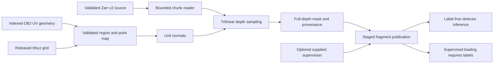

# Design and architecture review: surface rendering and fragment adapters

Reviewed the surface workflow from merged main `f59c94ee` on 2026-10-05.
Earlier reviews cover experiment lifecycle, detector inference, CT-volume
prediction, checkpoint analysis, fiber tracing, and submission evidence. This
pass follows OBJ/tifxyz geometry through Zarr reads, depth sampling, output
publication, qualitative inference, and supplied-label adapters.
Final documentation verification completed on 2026-10-07 after the workspace resumed.

## Findings and repairs

| Priority | Confirmed problem | Repair |
| --- | --- | --- |
| P1 | Chunk prefetch omitted all read errors; scalar reads also converted failed reads to fill values. A permission/network failure could produce a plausible zero-valued surface. | Preserve individual read errors. Only `FileNotFoundError` represents an uninitialized Zarr chunk. Reject corrupt payloads and unsupported metadata. |
| P1 | Writers published files incrementally, ignored failed PNG writes, and reused existing directories. Failed conversion left partial fragments; rerenders could retain stale depth slices or old ink labels. | Share a staged fragment publisher across all adapters. Validate inputs and JSON, check every write, publish the complete directory with one rename, and refuse existing ids. Validate fragment ids before constructing paths. |
| P1 | Qualitative extraction fabricated zero ink labels. Scroll-3 inference created and deleted a dummy label, overwriting a real label if one existed. | Qualitative fragments stay label-free. Use the detector's existing label-free loader/inference path. Teacher and registered-label callers supply actual supervision before publication. |
| P1 | OBJ rendering ignored region origins and assumed vertex/texture arrays were positionally paired. Rectangular OBJ rendering failed. Provenance could claim a crop that was never rendered and omitted the actual divisor. | Read face texture indices, including negative indices and distinct-UV seams. Add an explicit full UV-grid resolution for cropped regions. Support rectangles and record actual grid, UV bounds, source, divisor, and region. Nest caller metadata so it cannot overwrite facts. |
| P2 | `clamped_frac` counted nonfinite coordinates rather than depth clipping, used the wrong denominator, and missed entirely unsupported tiles. Saved masks still marked pixels with undefined normals or clipped depth as valid. | Count unsupported samples among all attempted geometry-valid samples. Save only pixels supported at every requested depth, record geometry coverage separately, zero excluded pixels, and refuse wholly unsupported regions. |
| P2 | uint16 source values became floats during interpolation, then were clipped as byte-range values, often whitening the output. Conversely, a uint8 value of 1 could be interpreted as normalized float intensity and become 255. | Scale uint16 by /256 before interpolation and quantize the rendered stack once in byte units. Preserve uint8 intensities, including low values. Require finite byte-range floating volumes. |
| P2 | Negative/oversized tifxyz crops, arbitrary normal multipliers, nonfinite divisors, and malformed sampling inputs failed late or silently changed the requested geometry. Flat auto-scale candidates were accepted; rectangular probes failed and persisted as regular output fragments. | Validate bounds, dimensions, levels, signs, divisors, and unit normals. Reject flat/empty scale candidates, use centered rectangular probes at the final grid resolution, and clean up probes. Operational read failures abort scale inference. |
| P2 | Conversion sorted depths lexicographically, silently selected a first TIFF channel or label, and failed to verify coherent source grids/masks. OBJ downloads collided by basename and interrupted transfers could enter the cache. | Sort numeric consecutive depth indices; require grayscale, aligned layers and unambiguous readable labels/masks. Cache meshes by the complete S3 key and publish completed downloads through temporary files. |
| P2 | Grouped cache warming had no explicit byte limit and could enumerate enormous chunk sets before allocation guards. | Bound decoded cache payload and each dense bbox to 512 MiB by default. Bound chunk-index counts separately, including tiny-chunk metadata, before constructing index lists. |
| P2 | Barycentric roundoff could produce a tiny negative coordinate at an exact zero boundary, causing a valid mesh to fail bounds validation. | Constrain interpolated coordinates to the source vertex extrema. Actual negative source geometry still fails volume bounds checks. |

The initial 26 regression cases produced **22 failures and 4 passes** against
the original implementation. The completed contract module contains **80 cases**,
including two boundary-range cases added during PR integration.
Tests use real local geometry TIFFs, analytic volumes, actual Zarr-v2 compressed
chunk bytes, detector loading, interrupted writes/downloads, and controlled
filesystem failures. They do not access research datasets or the network.

## Architecture and operator design

`repro/sota_data/obj_geometry.py` owns mesh acquisition and indexed vertex/UV
correspondence. `render_surface.py` owns geometry validation, source reads,
unit normals, interpolation coverage, and render provenance. Its grouped and
per-tile fetch strategies produce identical output, masks, and coverage for
clipped uint16 test data; normalization and read validation run once per fetch.
`render_cli.py` coordinates parameters and temporary scale probes.

`repro/sota_data/fragment.py` is the shared publication boundary. The renderer,
converter, qualitative adapter, distillation prep, and registered-label prep all
use it. It distinguishes absent labels from explicitly supplied labels and never
creates supervision. Existing fragments are refused rather than updated in place.
An exception before directory publication cleans up staging and preserves prior
fragments. A terminated process can leave a hidden staging directory; publication
is an atomic visibility operation, not a power-loss durability guarantee.



Rendering provenance is now **contract version 2**. `valid_frac` measures pixels
supported at every depth; `geometry_valid_frac` measures the center-point map;
`clamped_frac` counts unsupported depth samples among geometry-valid pixels.
`extra_prov` annotations are saved under `extra`, and cannot replace source or
recipe fields. The OBJ CLI records its original source argument there as well.

The zero-origin OBJ default still resamples the full UV bounding box at the
requested resolution. Nonzero origins now require `--obj-grid-size H W`, making
the crop's coordinate system explicit. Auto-scale probes use that same full-grid
resolution. tifxyz regions must fit the released grid exactly; whole-grid size 0
requires zero origins. Reruns require a fresh fragment id or output root.
The [surface renderer guide](SURFACE_RENDERER.md) documents these contracts.

**These repairs do not establish a new real-data accuracy result.** Historical
NCC tables remain unchanged. Their released-volume comparisons must be rerun
before using new crops, masks, intensity conversion, or auto-scale selection as
evidence for those measurements. Existing qualitative outputs with placeholder
labels are not migrated automatically; regenerate them in a fresh output root.

## Verification before PR integration

The suites overlap; their counts must not be added together.

Standard validation, now including the surface contracts and adapter tests:

```bash
OMP_NUM_THREADS=2 MKL_NUM_THREADS=2 MPLCONFIGDIR=/tmp/vesuvius-matplotlib .venv/bin/python scripts/run_validation_tests.py
```

**586 passed, 3 skipped, 9 warnings in 34.51 seconds.** Skips are the two optional
CUDA fiber tests and the optional live-S3 test. Warnings concern CPU data-loader
pinning, outside the surface workflow.

Broader surface and SOTA suite:

```bash
OMP_NUM_THREADS=2 MKL_NUM_THREADS=2 MPLCONFIGDIR=/tmp/vesuvius-matplotlib .venv/bin/python -m pytest tests/test_surface_render_contracts.py tests/test_render_surface.py tests/test_sota_*.py -q --tb=short
```

**156 passed, 2 warnings in 9.18 seconds.** The warnings are existing TIFF
photometric-layout deprecations in registration fixtures. This suite includes
teacher adapters, registration, target metadata, and cross-scroll partitioning.

Smoke checks:

```bash
OMP_NUM_THREADS=2 MKL_NUM_THREADS=2 MPLCONFIGDIR=/tmp/vesuvius-matplotlib .venv/bin/python scripts/smoke_test.py
```

**8 of 11 passed, 3 skipped, 0 failed in 8.6 seconds.** Skips require missing
training data or the optional upstream augmentation API.

Documentation guards:

```bash
OMP_NUM_THREADS=2 MKL_NUM_THREADS=2 MPLCONFIGDIR=/tmp/vesuvius-matplotlib .venv/bin/python -m pytest tests/test_audit_doc_references.py tests/test_audit_report_claims.py tests/test_withdrawn_claims_stay_withdrawn.py tests/test_arm_tiers.py tests/test_audit_arm_coverage.py tests/test_analyse_flat_displacement.py tests/test_quotations_match_source.py tests/test_analyse_pooled_fit_only_floor.py tests/test_analyse_ink_maximum_offset.py tests/test_filing_2026_10_numbers.py -q --no-header --tb=short
```

**103 passed, 1 skipped in 13.76 seconds.** The skip needs an absent external
render artifact.

Ruff 0.9.10 check and format-check pass for all 13 changed Python files, using
the existing offline tool cache. `git diff --check` also passes.

Repository-wide mypy 1.19.1:

```bash
UV_CACHE_DIR=/workspace/.cache/uv UV_TOOL_DIR=/workspace/.cache/uv-tools uv tool run --offline --from mypy==1.19.1 mypy . --explicit-package-bases --namespace-packages --python-executable .venv/bin/python
```

**16 errors in 13 files**, all outside the changed files. The prior baseline was
17 errors in 14 files; checking each loaded TIFF before stacking removes the
existing registered-label adapter diagnostic. Remaining issues concern missing
Requests/YAML stubs, OpenCV annotations, augmentation slice indices, optional
loader tensors, and teacher-logit tensor lists. Repository-wide typing still fails.

## PR integration verification (2026-10-07)

Rebased the review onto current main `f5f775c3`, retaining the upstream fiber
scoring and research-report changes. Revalidation exposed the interpolation
roundoff case repaired above. The final integrated branch passed:

- The same standard validation command: **589 passed, 3 skipped, 9 warnings
  in 41.66 seconds**. The skips and warnings have the same causes listed above.
- The same broader surface/SOTA command: **158 passed, 2 warnings in 13.23
  seconds**, including the two new vertex-boundary regression cases.
- Documentation guards plus the new upstream report/parity tests:

```bash
OMP_NUM_THREADS=2 MKL_NUM_THREADS=2 MPLCONFIGDIR=/tmp/vesuvius-matplotlib .venv/bin/python -m pytest tests/test_audit_doc_references.py tests/test_audit_report_claims.py tests/test_withdrawn_claims_stay_withdrawn.py tests/test_arm_tiers.py tests/test_audit_arm_coverage.py tests/test_analyse_flat_displacement.py tests/test_quotations_match_source.py tests/test_analyse_pooled_fit_only_floor.py tests/test_analyse_ink_maximum_offset.py tests/test_filing_2026_10_numbers.py tests/test_fiber_scoring_matches_scrollgt.py tests/test_soft_count_report_numbers.py -q --no-header --tb=short
```

**106 passed, 16 skipped in 20.86 seconds.** Fifteen parity cases require an
absent sibling ScrollGT checkout; the remaining skip requires the external render
artifact noted above. These are optional upstream checks, not surface test skips.
Ruff check and format-check remain clean on the changed Python files. Mypy still
reports **16 existing errors in 13 unchanged files**, now checking 605 source files.

## Remaining limits

- No live S3 transfer, full-scroll render, real-data NCC/depth comparison, model
  training, GPU inference, or end-to-end registration experiment was run.
- The OBJ interpolator still uses a UV convex hull rather than face-constrained
  rasterization. Its supported input is a single regular UV patch; use released
  tifxyz or villa for holes and overlapping islands. Face indices now correct
  correspondence, but do not remove that existing topology limitation.
- Texture-based scale choice remains a heuristic and can be ambiguous. Flat
  rejection and truthful provenance do not establish placement accuracy.
- The direct chunk reader supports 3D Zarr v2 with supported codecs and no
  filters. Other layouts fail explicitly. The memory caps bound individual
  buffers and cache/index counts, not total process memory or whole-grid size.
- OBJ cache keys assume immutable remote objects and do not check ETags on reuse.
  The cache namespace fixes cross-source collisions and interrupted transfers;
  explicitly remove cached entries when a remote key is updated.
- Registration mathematics and research-model/evaluation recipes were not changed.
  This pass fixes their artifact publication and missing-layer handling.
