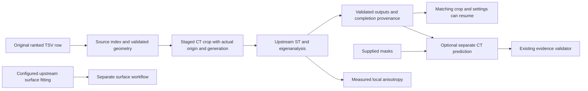

# Design and architecture review: candidate preprocessing and tensor measurement

Reviewed baseline `5169572e`, after the detector, submission, fiber, CT inference,
checkpoint, and surface-renderer reviews. This pass follows the remaining ranked
candidate workflow through crop publication, structure tensors, resume decisions,
and optional CT evidence. The product is a research CLI workflow.

## Findings and repairs

| Priority | Verified problem | Repair |
|---|---|---|
| P1 | The worklist filters and reranks candidates, then uses the new priority rank as an index into the original TSV. Generated evidence commands also hardcode a different ranked file. This can evaluate the wrong candidate. | Preserve the original `candidate_index` separately from processing `rank`, share the existing candidate loader, and use the supplied ranked path in generated commands. Regression cases exercise reranking and filtering. |
| P1 | Crop replacement deletes the destination before reading the source. Source/output aliases can destroy the source itself, and a failed read destroys prior good output. Fractional coordinates are silently truncated. | Reject overlapping/canonical path aliases and invalid integers. Copy into a staged directory, publish after successful writes and provenance, and roll back ordinary rename failures. Retain source storage settings and actual clamped origin. |
| P1 | Resume accepts empty `.zarray` markers, only one normal component, or a prediction path in metadata as completed output. It does not check the current candidate. | Share crop/tensor contracts and completion records. Check source identity, requested geometry, crop generation, sigma, and every eigenanalysis component. Revalidate actual evidence with the existing submission validator, including candidate index, geometry, supplied masks, and checkpoint path. |
| P1 | Failed crop/ST candidates are skipped with exit zero; fitting, refinement, evidence, and validation failures are ignored. A later run can retain an earlier apparent success. | Stop dependent stages for the failed candidate, aggregate all candidate results, exit 1 if any fail, and invalidate the previous execution report before attempting work. Successful exit without matching output also fails. |
| P2 | The “fitting” call invokes `lasagna_analyze.py`, an existing-model visualization/export tool, with unsupported `--volume` and `--iterations` arguments. Batch refinement receives a mesh where it expects a volume, a volume where it expects a folder, and no parameter JSON. Neither surface feeds the subsequent CT prediction. | Remove the unsupported fitting/refinement calls. The default workflow explicitly performs CT preprocessing. Surface fitting remains a separate configured upstream workflow; optional CT evidence is named and documented as CT evidence. No fitting recipe or transform is invented. |
| P2 | The ST wrapper uses `python3` instead of the active interpreter, resolves upstream code relative to CWD, crashes for a bare output name, and displays a rho value that it never passes or applies. Direct writes can leave partial output. | Use resolved repository paths and the active interpreter, stage output, validate readable tensor/eigenanalysis arrays before completion, and reject unsupported rho explicitly. Sigma/GPU settings are checked before processing. |
| P1 | The deformation command loads a volume but computes every reported score from seeded random eigenvalues. It cannot parse the actual `structure_tensor` group and claims that higher FA proves successful flattening. | Read the actual packed upstream channels, compute symmetric eigenvalues and scale-invariant FA in bounded blocks, reject invalid tensors, and disclose zero-tensor coverage. Remove the simulated “Coherence Score” and unsupported registration interpretation. FA is local anisotropy and is rotation invariant. |

The initial 25-case regression run produced **23 failures and 2 passes**. It
reproduced incorrect candidate identity, malformed geometry acceptance, unsafe
crop replacement, false completion, and measurements unrelated to the input.
Additional integration cases cover complete publication, resume, forced
regeneration, worker failure, and current evidence validation.

## Architecture and operator design

The existing detector and submission validator remain the authorities for CT
prediction and readiness. `scripts/candidate_artifacts.py` supplies only the
shared local artifact boundary: readable arrays, integer geometry, bounded
selection blocks, staged publication, completion matching, and finite JSON.
The preprocessing orchestrator does not recreate ML or readiness logic.

`--with-evidence` requires mask paths in each selected TSV row. A preprocessing
success has a stated scope and does not imply surface fitting or prize readiness.
Failure results identify the affected candidate and stage, and overall failure
is visible to shell automation. Old marker-only outputs are recomputed rather
than silently trusted.

[Candidate preprocessing](CANDIDATE_PREPROCESSING.md) documents the commands,
path rules, actual crop origin, output contracts, optional evidence, and FA
interpretation. The README links to it. Published measurements, preregistrations,
model checkpoints, dependency versions, training/evaluation algorithms, and the
villa submodule are unchanged.

## Verification

- Standard validation:
  `OMP_NUM_THREADS=2 MKL_NUM_THREADS=2 MPLCONFIGDIR=/tmp/vesuvius-matplotlib .venv/bin/python scripts/run_validation_tests.py`
  — **659 passed, 3 skipped, 9 warnings** in 50.01 s. The runner now includes
  the candidate contracts and prior crop/worklist/resume tests. Optional CUDA
  and live S3 cases skip; warnings concern CPU data-loader pinning.
- Related worklist, readiness, handoff, review-manifest, preflight-summary, and
  action-matrix integration: **35 passed** in 6.65 s, using
  `OMP_NUM_THREADS=2 MKL_NUM_THREADS=2 MPLCONFIGDIR=/tmp/vesuvius-matplotlib .venv/bin/python -m pytest tests/test_prize_readiness.py tests/test_execute_lasagna_pipeline_resume.py tests/test_lasagna_fiber_worklist.py tests/test_villa_review_manifest.py tests/test_post_sprint_villa_handoff.py tests/test_summarize_villa_evidence_preflight.py tests/test_villa_prize_action_matrix.py -q --tb=short`.
- Tests use actual local Zarr arrays, analytic isotropic/rank-one/planar tensors,
  explicit read/rename failures, complete ST output fixtures, and the shared
  valid submission-evidence fixture. Upstream GPU computation is replaced by
  a local stand-in at the subprocess boundary; wrapper publication and resume
  operate on real files. Three real subprocesses verify CLI help from outside
  the checkout.
- An additional CPU check used the pinned upstream `StructureTensorComputer`
  (`sigma=2`, component smoothing enabled) on a 24³ synthetic ramp `z+2y+3x`.
  New FA agrees with FA derived from upstream's `eigendecompose` across **13,824
  voxels**: mean FA 0.888131, maximum absolute difference **3.6e-08**, within
  `rtol=1e-5, atol=1e-6`. This exercises the actual upstream packed channel order
  and tensor calculation; it does not exercise the upstream GPU runner.

- Focused candidate/crop/worklist/resume suite: **70 passed** in 6.89 s:
  `OMP_NUM_THREADS=2 MKL_NUM_THREADS=2 MPLCONFIGDIR=/tmp/vesuvius-matplotlib .venv/bin/python -m pytest tests/test_candidate_preprocessing_contracts.py tests/test_crop_candidate_zarr.py tests/test_lasagna_fiber_worklist.py tests/test_execute_lasagna_pipeline_resume.py -q --tb=short`.
- Documentation, claim, filing, and upstream parity guards: **106 passed,
  16 skipped** in 16.12 s:
  `OMP_NUM_THREADS=2 MKL_NUM_THREADS=2 MPLCONFIGDIR=/tmp/vesuvius-matplotlib .venv/bin/python -m pytest tests/test_audit_doc_references.py tests/test_audit_report_claims.py tests/test_withdrawn_claims_stay_withdrawn.py tests/test_arm_tiers.py tests/test_audit_arm_coverage.py tests/test_analyse_flat_displacement.py tests/test_quotations_match_source.py tests/test_analyse_pooled_fit_only_floor.py tests/test_analyse_ink_maximum_offset.py tests/test_filing_2026_10_numbers.py tests/test_fiber_scoring_matches_scrollgt.py tests/test_soft_count_report_numbers.py -q --no-header --tb=short`.
  Skips require the absent sibling ScrollGT checkout or an external render artifact.
- Ruff 0.9.10 lint and format checks pass for all **9 changed Python files**.
  `git diff --check` passes. No dependencies were installed or added.
- Repository-wide mypy 1.19.1:
  `UV_CACHE_DIR=/workspace/.cache/uv UV_TOOL_DIR=/workspace/.cache/uv-tools uv tool run --offline --from mypy==1.19.1 mypy . --explicit-package-bases --namespace-packages --python-executable .venv/bin/python`
  — **16 existing errors in 13 files**, checking 607 source files. All diagnostics
  are outside changed files and match the preceding review's baseline. This
  repository-wide gate still fails; the review does not report it as passing.

## Remaining limits

No live S3, GPU tensor computation, trained model inference, surface fitting,
refinement, or before/after registration study was run. No accuracy,
registration-success, or performance improvement is claimed.

Directory replacement uses two renames, with rollback for ordinary failures;
concurrent writers/readers and crash-atomic replacement are not supported. A
killed process can leave a hidden backup/staging directory. Candidate reads are
bounded in requested voxels, not in underlying chunk decompression memory.

Completion markers record successful local execution and input provenance, not
cryptographic content attestations. Resume does not rescan all payloads or detect
in-place edits to the original CT volume or checkpoint. Use `--force` when those
inputs change. Source crop generations do invalidate older ST completion records.
FA remains a diagnostic of local anisotropy, not a spatial coherence metric or a
deformation gate. This review does not execute every historical experiment script.
