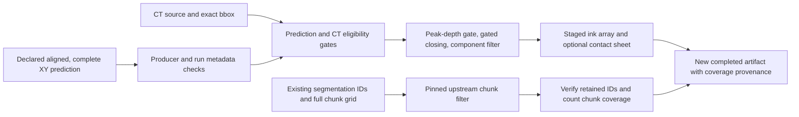

# Design and architecture review: volumetric labels

Reviewed baseline `6b15e6f7`, following the candidate preprocessing review. This
pass examines `scripts/labeling/generate_3d_ink_labels.py` and
`scripts/labeling/curate_training_data.py`, including their input geometry,
operator controls, scientific interpretation, upstream integration, and artifact
publication. These are local research CLI workflows.

## Findings and repairs

| Priority | Verified problem | Repair |
|---|---|---|
| P1 | The ink generator silently clips upper CT bounds, accepts negative bounds, and takes the first plane of any 3D prediction. It can associate labels with a different region from the reported bbox. | Require nonnegative integer bounds fully inside a nonempty 3D source. Accept only matching 2D/singleton-depth probability maps and explicit level 0 groups. Reject invalid probabilities and CT values before publication. |
| P1 | Matching XY dimensions are treated as sufficient spatial alignment. Flattened surface UV coordinates are not generally CT XY coordinates; producer origin, source, and OME transforms are ignored. | Require an explicit declaration of aligned, fully evaluated CT XY predictions. Verify available producer and run metadata against source, origin, dimensions, and supported OME coordinates. Decline unsupported frames and partial inference records. Registration is a prerequisite, not fabricated by this tool. |
| P1 | Morphological closing can add labels outside the prediction, CT-intensity, and peak-depth gates. `--close` is described as a radius but interpreted as footprint side length. | Use cubic side length `2*r+1` and intersect the refined labels with every eligibility gate. Regression fixtures exercise prediction holes, low-intensity holes, and displaced CT peaks. Default unrefined threshold recipes are retained. |
| P1 | Generation writes directly into existing outputs without checking source identity, shape, or dtype. Source/output aliases can overwrite CT values. A debug failure happens after labels are already published. | Reject existing outputs and canonical source aliases/overlap. Stage each new full-shape sparse artifact and its optional PNG; publish only after writes and completion metadata succeed. Declare the exact evaluated bbox and the meaning of outside zeros. |
| P1 | The moved curator imports from `scripts/villa/...`, so even `--help` fails. Upstream skips partial chunks, including every chunk when an input is smaller than the requested evaluation size. | Resolve upstream from the checkout and load it after preflight. Require chunk size to divide every dimension before invoking the unchanged filter. Accept bare arrays and explicit level 0 inputs. |
| P2 | The curator's `--reject-branches` flag has a true default and only a true action, so it cannot be disabled. Invalid worker/filter settings are not checked. Existing results are overwritten before processing completes. | Add `--no-reject-branches`, validate finite and ordered bounds and positive workers/chunk size, stage new results, preserve retained instance IDs/dtype, and verify the all-or-zero chunk contract before publication. |
| P2 | CT intensity is described as proof of ink material, curation success as a “Gold Standard” dataset, and debug contours use a hardcoded threshold of 0.1. Disabled component filtering reports zero measured components. | State the heuristic interpretation in CLI/docs and correct the current Sprint 027 claim. Use the applied threshold and source z indices in debug sheets. Report disabled component counts as null and report actual retained-chunk coverage, including an all-rejected result. |

The initial regression run reproduced **20 failures and 5 passes**, including
silent bound clipping, negative coordinates, multi-plane selection, invalid input
acceptance, destructive aliasing/reuse, closing leakage, and a broken help entry
point. Subsequent cases cover real producer metadata, explicit alignment,
partial-run rejection, publication errors, real upstream filtering, and instance
ID preservation.

## Architecture and operator design

Shared local label helpers enforce array selection, geometry, finite settings,
and new artifact paths. They reuse `scripts/candidate_artifacts.py` for integer
validation, canonical path separation, and staged directory publication. The
existing submission evidence validator remains the authority for the supported
VC3D/OME metadata layout; this change does not duplicate that coordinate parser.
Curation calls the pinned upstream `process()` with its original filter recipe.

The ink and sheet-segmentation workflows have separate purposes. Neither success
message establishes ground truth or submission readiness. Source metadata and
coverage are carried in completion attributes. Outside-bbox ink zeros and
rejected/empty segmentation chunks cannot automatically be treated as verified
negative training labels. The guide documents the obligations of consumers.

[Volumetric label workflows](VOLUMETRIC_LABELS.md) gives commands, frame/input
contracts, parameter semantics, output attributes, and migration details. The
README links to it. Existing in-place ink accumulation is replaced by independent
new outputs so sources and recipes cannot be mixed silently. Debug PNGs belong
inside their output artifact. No dependency, trained checkpoint, training or
evaluation algorithm, published measurement, or villa source was changed.

## Verification

- PR-template smoke check:
  `OMP_NUM_THREADS=2 MKL_NUM_THREADS=2 MPLCONFIGDIR=/tmp/vesuvius-matplotlib .venv/bin/python scripts/smoke_test.py`
  — **8/11 passed, 3 skipped, 0 failed** in 11.4 s. Imports, model builds,
  multitask forward/backward paths, checkpoint loading, augmentation, and bandit
  templates pass. Skips require absent training data or the optional bg2 transform.
- Standard validation:
  `OMP_NUM_THREADS=2 MKL_NUM_THREADS=2 MPLCONFIGDIR=/tmp/vesuvius-matplotlib .venv/bin/python scripts/run_validation_tests.py`
  — **768 passed, 3 skipped, 9 warnings** in 57.08 s. The runner includes
  **109 new regression cases** for the two label workflows. Optional CUDA/live-S3
  cases skip; warnings concern CPU data-loader pinning.
- Tests use real local Zarr arrays and the repository's actual prediction
  exporter. Cases cover exact nonzero bbox placement, sparse outside coverage,
  unchanged per-column/global threshold recipes, each refinement gate, component
  filtering, metadata conflicts, partial prediction records, and debug contours.
  Explicit read, write, metadata, debug, and worker failures exercise cleanup.
- Real pinned upstream curation tests cover bare/level-0 inputs, unchanged uint16
  instance IDs, density-based all-rejected output, and the enabled/disabled branch
  heuristic on a synthetic junction. A real CLI with two workers runs from outside
  the checkout; help and error exits also run in separate interpreters. Failure
  fixtures replace only the upstream processing boundary to test publication of
  partial, malformed, altered, or unreadable outputs.
- Documentation, claim, filing, and upstream parity guards: **106 passed,
  16 skipped** in 12.87 s:
  `OMP_NUM_THREADS=2 MKL_NUM_THREADS=2 MPLCONFIGDIR=/tmp/vesuvius-matplotlib .venv/bin/python -m pytest tests/test_audit_doc_references.py tests/test_audit_report_claims.py tests/test_withdrawn_claims_stay_withdrawn.py tests/test_arm_tiers.py tests/test_audit_arm_coverage.py tests/test_analyse_flat_displacement.py tests/test_quotations_match_source.py tests/test_analyse_pooled_fit_only_floor.py tests/test_analyse_ink_maximum_offset.py tests/test_filing_2026_10_numbers.py tests/test_fiber_scoring_matches_scrollgt.py tests/test_soft_count_report_numbers.py -q --no-header --tb=short`.
  Skips require the absent sibling ScrollGT checkout or external render artifacts.
- Ruff 0.9.10 lint and format checks pass for all **6 changed Python files**,
  using the existing offline tool cache. `git diff --check` passes. No dependency
  was installed or added.
- Repository-wide mypy 1.19.1:
  `UV_CACHE_DIR=/workspace/.cache/uv UV_TOOL_DIR=/workspace/.cache/uv-tools uv tool run --offline --from mypy==1.19.1 mypy . --explicit-package-bases --namespace-packages --python-executable .venv/bin/python`
  — **16 existing errors in 13 files**, checking 610 source files. Diagnostics
  are outside the changed files and match the preceding review's baseline:
  requests/YAML stubs, OpenCV overloads, augmentation slice types, and loader/
  training tensor-list annotations. This repository-wide check still fails.

## Remaining limits

No real-scroll label accuracy study, GPU/model inference, registered UV-to-CT
lifting, whole-scroll performance run, or training experiment was performed.
The checks establish local input/gating/publication contracts and upstream
integration, not scientific accuracy. CT maxima are depth heuristics and CT
intensity alone does not identify ink.

Alignment and complete prediction coverage remain caller declarations for bare
maps without metadata. Available metadata must match, but is not a cryptographic
attestation and does not detect in-place edits to CT, prediction, or label input.
Inputs must stay stable during execution. Other OME compositions require a
separate verified registration/export step.

Writers must be serialized. Ordinary failures clean up staging and leave no final
artifact; a process killed during work can leave a hidden staging folder. Ink
generation materializes the requested bbox; curation verification reads one
evaluation chunk at a time, while the pinned upstream implementation creates its
full worklist/futures in memory. Underlying Zarr decompression can exceed the
requested slice size. Chunk-local connectivity/branch tests do not establish
whole-volume topology. These concerns are documented rather than hidden behind
quality or production-scale claims.

This pass does not review every historical labeling, meshing, registration, or
training script. Repository-wide mypy retains the prior review's unrelated
baseline diagnostics; the final verification records them explicitly.
