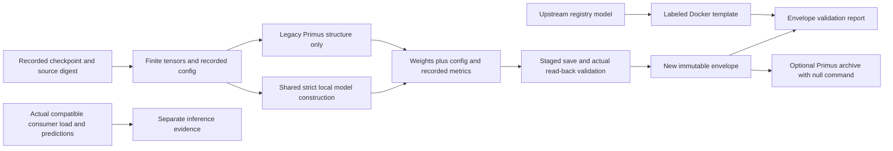

# Design and architecture review: checkpoint export

Reviewed baseline `1082524e`, following the merged geometry handoff review. This
pass covers checkpoint-envelope export and the optimized-inference smoke/package
handoff: weight/configuration contracts, provenance, failure reporting, output
publication, and the distinction between an exported file and consumer evidence.

## Findings and repairs

| Priority | Verified problem | Repair |
|---|---|---|
| P1 | Export writes directly to the requested path, including the input checkpoint or an existing research artifact. | Require a new source-disjoint output, stage it, read it back with the actual strict model validator, and publish only after success. Unsafe destinations and write/read/rename failures preserve prior artifacts. |
| P1 | Architecture guessing depends on the first key, trusts contradictory declarations, and accepts incomplete/nonfinite weights. The local ResNet decoder actually uses `backbone.*`, sharing a prefix with TimeSformer. | Require recorded configuration, validate finite real dense tensors, and reconstruct local models through the existing shared factory with complete strict weights. Legacy Primus envelopes are explicitly limited to structural validation. |
| P1 | Primus export reads an unrelated CWD-relative launcher marker and hashes current external files, attaching lineage and guessed window settings to a checkpoint without a binding. | Read provenance only from the checkpoint's recorded configuration, retain its declarations as unverified, require recorded shape, and bind the export to the canonical source checkpoint SHA-256. Ignore ambient markers and external files. |
| P1 | The Docker smoke command selects a registry model and never consumes the exported checkpoint, so a successful container could be presented as handoff evidence for different weights. | Label commands as registry-model templates, explicitly scope PASS to envelope validation, preserve `inference_verified: false`, and refuse `--execute-docker` through this checkpoint-verification command. No external container or upload is launched. |
| P1 | The Primus package advertises native `train_py` inference, but its envelope lacks the actual loader's `model`/`model_config` and normalization contract. | Keep an optional immutable archive, with byte-preserving checkpoint copy, an explicit blocker, and a null prediction command. Preserve the native upstream loader and explain why a native checkpoint/compatible model load is still required. |
| P2 | Export manufactures a zero missing `val_bpb`, drops the recorded F1/lift/AUC fields, and uses an unrelated DINO version label. | Keep recorded finite scalar metrics, leave missing measurements unknown, and use a versioned envelope contract. Metadata separates local weight validation, recorded lineage, inference, and eligibility. |
| P2 | Smoke validation can crash on malformed checkpoint/config/metadata, write stale or aliased reports, and claim success without a clear validation scope. Direct script imports depend on CWD. | Share envelope validation, report ordinary input failures as finite FAIL JSON/nonzero CLI exits, preflight all destinations, bootstrap repository imports, and require explicit new artifact paths. |

The initial regression suite reproduced **8 failures** before repairs: source
overwrite, partial weights, contradictory architecture, fabricated missing
metric/dropped measurements, ambient marker lineage, execution of an unrelated
Docker model, incompatible Primus inference commands, and nonfinite weights.

## Architecture and operator design



The shared `build_tool_model` helper is extracted from the existing strict
checkpoint loader; auxiliary analysis commands retain their public return
contract and numerical behavior. Export and smoke use the same configuration,
model factory, and envelope checks. The existing artifact publishers are reused
instead of adding a second staging implementation.

Local model loading does not establish upstream compatibility. A Primus archive
does not become a native training checkpoint through a renamed weight key or a
plausible command. Recorded metrics and lineage are declarations carried from
the source, not fresh measurements or a reconstruction of training history.
The [operator guide](CHECKPOINT_EXPORT.md) explains commands, migration, output
contracts, and the remaining inference boundary.

No training/evaluation mathematics, model definitions, checkpoints, dependency
definitions, pinned villa sources, published measurements, or preregistrations
were modified. This review makes no accuracy or performance claim.

## Verification

The standard runner now includes both export/handoff test files. Tests use actual
small local models, strict reloads, deterministic input predictions, trusted
synthetic checkpoints, real filesystem publication, separate CLI interpreters,
and failure injection. A separate check exports the repository's real
`best_model.pt` into a temporary directory and verifies all **288/288 tensors**
with exact dtype/value preservation, strict reload, and unchanged source digest.

### Standard validation

```sh
OMP_NUM_THREADS=2 MKL_NUM_THREADS=2 MPLCONFIGDIR=/tmp/vesuvius-matplotlib .venv/bin/python scripts/run_validation_tests.py
```

```text
1003 passed, 3 skipped, 1 xfailed, 9 warnings in 156.90s (0:02:36)
```

This includes **73 export regressions** and **10 revised handoff cases**, together
with the preceding workflow/geometry/label/model contract suites. New cases cover
real model round trips and equal predictions, float16/float64 value and dtype
preservation, strict read-back of the actual saved file, finite/complete inputs,
key-order independence, legacy/ambiguous weight keys, recorded metrics/lineage,
source changes, alias/overlap protection, failed writes/renames/copies, metadata
disagreements, finite failure reports, and real CLIs outside the checkout. The
actual pinned upstream state selector demonstrates the Primus envelope mismatch.

Skips need optional CUDA/live-S3 capabilities. The expected failure is the
previously documented pinned Mutex dataset-loader channel-slicing defect;
warnings concern CPU pinning. These limits are unchanged.

### Required smoke

```sh
OMP_NUM_THREADS=2 MKL_NUM_THREADS=2 MPLCONFIGDIR=/tmp/vesuvius-matplotlib .venv/bin/python scripts/smoke_test.py
```

```text
Loaded 288/288 compatible tensors from best_model.pt (skipped missing=0, shape=0).
--- 8/11 passed, 3 skipped, 0 failed in 11.6s ---
```

Imports, model construction, multitask forward/backward, checkpoint loading,
available augmentation, and bandit checks pass. Skips need two absent training
fixtures or the optional bg2 transform.

### Real checkpoint export

```sh
OMP_NUM_THREADS=2 MKL_NUM_THREADS=2 .venv/bin/python - <<'PY'
import tempfile
from pathlib import Path
import torch
from scripts.export_for_production import export_checkpoint, sha256_file
from scripts.smoke_test_villa_optimized_inference import validate_exported_checkpoint
source = Path('best_model.pt').resolve()
before = sha256_file(source)
original = torch.load(source, map_location='cpu', weights_only=False)
with tempfile.TemporaryDirectory(prefix='vesuvius-checkpoint-export-') as directory:
    output = Path(directory) / 'model.pt'
    export_checkpoint(source, output)
    exported, failures = validate_exported_checkpoint(output)
    assert not failures, failures
    for name, tensor in original['model_state_dict'].items():
        actual = exported['model_state_dict'][name]
        assert actual.dtype == tensor.dtype
        torch.testing.assert_close(actual, tensor, rtol=0, atol=0)
    assert sha256_file(source) == before
    assert exported['metadata']['source_sha256'] == before
    print(f"PASS: best_model.pt {len(exported['model_state_dict'])}/{len(original['model_state_dict'])} tensors preserved with exact values and dtypes")
    print('PASS: source unchanged; strict local reload succeeded; temporary output removed after check')
PY
```

```text
Weights: STRICT_LOCAL_MODEL_LOAD; inference compatibility and submission eligibility unverified
PASS: best_model.pt 288/288 tensors preserved with exact values and dtypes
PASS: source unchanged; strict local reload succeeded; temporary output removed after check
```

The current real ResEnc checkpoint works through the local wrapper contract;
no upstream registry-model or native Primus compatibility is inferred.

### Lint, formatting, and whitespace

```sh
UV_CACHE_DIR=/workspace/.cache/uv UV_TOOL_DIR=/workspace/.cache/uv-tools uv tool run --offline --from ruff==0.9.10 ruff check scripts/export_for_production.py scripts/smoke_test_villa_optimized_inference.py src/vesuvius_autoresearch/core/checkpoint_tools.py scripts/run_validation_tests.py tests/test_checkpoint_export_contracts.py tests/test_villa_optimized_inference_smoke.py
UV_CACHE_DIR=/workspace/.cache/uv UV_TOOL_DIR=/workspace/.cache/uv-tools uv tool run --offline --from ruff==0.9.10 ruff format --check scripts/export_for_production.py scripts/smoke_test_villa_optimized_inference.py src/vesuvius_autoresearch/core/checkpoint_tools.py scripts/run_validation_tests.py tests/test_checkpoint_export_contracts.py tests/test_villa_optimized_inference_smoke.py
git diff --check
```

```text
All checks passed!
6 files already formatted
```

All changed Python files and whitespace checks pass using existing cached tools.

### Repository typing

```sh
UV_CACHE_DIR=/workspace/.cache/uv UV_TOOL_DIR=/workspace/.cache/uv-tools uv tool run --offline --from mypy==1.19.1 mypy . --explicit-package-bases --namespace-packages --python-executable .venv/bin/python
```

```text
Found 16 errors in 13 files (checked 618 source files)
```

This check remains failing. Diagnostics are the existing YAML/requests stubs,
OpenCV overloads, augmentation slice types, and loader/training tensor-list
annotations, all outside changed files.

### Documentation, claims, filing, and upstream parity guards

```sh
OMP_NUM_THREADS=2 MKL_NUM_THREADS=2 MPLCONFIGDIR=/tmp/vesuvius-matplotlib .venv/bin/python -m pytest tests/test_audit_doc_references.py tests/test_audit_report_claims.py tests/test_withdrawn_claims_stay_withdrawn.py tests/test_arm_tiers.py tests/test_audit_arm_coverage.py tests/test_analyse_flat_displacement.py tests/test_quotations_match_source.py tests/test_analyse_pooled_fit_only_floor.py tests/test_analyse_ink_maximum_offset.py tests/test_filing_2026_10_numbers.py tests/test_fiber_scoring_matches_scrollgt.py tests/test_soft_count_report_numbers.py -q --no-header --tb=short
```

```text
106 passed, 16 skipped in 33.65s
```

These guards pass. Skips require the absent sibling ScrollGT checkout or external
render artifacts. Counts across suites overlap and are not additive.

## Remaining limits

Legacy Primus envelopes receive structural validation only. The actual pinned
`train_py` state selector is exercised independently of optional ML bootstrap;
this proves the envelope mismatch, not that a converted Primus model works.
Native villa checkpoints must retain their model, configuration, EMA selection,
and normalization information for their intended consumer. No converter was
invented and no upstream loading contract was relaxed.

No Docker image was built/pulled/run, registry/S3 prediction was executed, GPU
training was launched, real-scroll accuracy was measured, or inference throughput
was benchmarked. Registry command templates remain independent of local exports.
Source hashes identify input bytes; they do not attest training data, physical
calibration, or external pretrain/config lineage. Keep inputs stable and writers
serialized. An abruptly terminated process may leave a hidden staging file, and
a completed envelope may remain when a later handoff stage fails.

Other historical launchers and experiment scripts remain outside this focused
export review. Previously documented optional-runtime skips, upstream Mutex
loader failure, and unrelated repository mypy errors remain explicit limitations.
