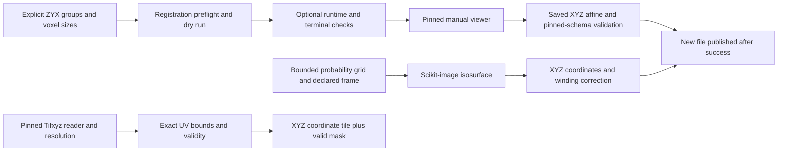

# Design and architecture review: geometry handoff

Reviewed baseline `b16e683e`, after the Mutex review. This pass covers
`scripts/register_volumes.py`, `scripts/voxelize_predictions.py`, and
`scripts/labeling/tifxyz_wrapper.py`: command design, coordinate semantics,
upstream integration, numerical declarations, and output publication.

## Findings and repairs

| Priority | Verified problem | Repair |
|---|---|---|
| P1 | The prediction exporter runs instance-label pruning on probabilities with unsupported flags, then invokes a mesh-to-voxel tool to supposedly create an OBJ. It claims submission readiness without producing geometry. | Export a bounded real probability-grid isosurface through the existing scikit-image implementation; write actual validated XYZ vertices and triangles with recorded recipe/frame provenance. Remove pruning and readiness claims. |
| P1 | Registration accepts missing or unsupported sources, guesses fixed voxel size, omits moving voxel size, and claims perfect alignment/training integration. Its tool path and interpreter depend on CWD. | Validate separate local ZYX level-0 groups and explicit positive isotropic voxel sizes, check available scan metadata, reject unsupported OME frames, and use the active interpreter and pinned absolute path. Plan by default; explicit execution requires a terminal and runtime probe. |
| P1 | Registration says Ctrl+D saves, treats any successful REPL exit as a saved transform, swallows subprocess failures with exit zero, and writes directly to an existing output. | Explain the actual W save action, stage the viewer output, require a saved payload matching the pinned schema, check finite nonsingular affine/source/landmark contracts, and publish only after success. Report failure or interruption nonzero. |
| P1 | An absent optional Tifxyz import leaves an undefined annotation, so importing the wrapper fails with NameError. Failed loads return None. UV slices silently clip/wrap and stored/full resolution is ambiguous. | Lazy-load the actual pinned package independently of ML bootstrap, propagate errors, expose resolution explicitly, validate exact UV bounds and tile shape, preserve XYZ order, and honor/refine validity without mutating source arrays. |
| P2 | A grid mesh has no explicit origin, spacing, coordinate order, or unit declaration; reversing axis order can reverse face orientation. | Declare local-grid defaults and optional origin/spacing/units; convert ZYX vertices to XYZ and reverse triangle winding. Embed one provenance record in the atomically published OBJ. No implicit registration or metadata transform is claimed. |
| P2 | Bounded reads and new-file publication would otherwise be duplicated across geometry and Mutex TIFF export. | Move the existing fragment bound into shared label-artifact helpers and add one immutable staged-file publisher. Existing Mutex APIs retain the same bound and numerical behavior. |

Initial regression probes reproduced **4 failures**: import-time NameError,
missing CWD-relative exporter paths, launching registration with absent sources,
and a false saved-transform success message. Expanded checks exercise the
repaired APIs and publication boundaries.

## Architecture and operator design

The workflows retain separate responsibilities. A registration JSON is a manual
native-volume XYZ affine; a mesh is an isosurface of a declared probability grid;
a Tifxyz tile is an upstream coordinate/validity lookup at an explicit UV
resolution. None supplies missing UV-to-CT registration or turns successful
execution into accuracy evidence.

`scripts/geometry_artifacts.py` owns finite numeric declarations and transform
validation against the actual pinned schema. Shared label helpers own volume
selection, bounded fragments, canonical new-output separation, and file
publication. Mutex TIFF export now uses the same publisher, with unchanged
dtype/values. Actual villa sources, interpolation, registration mathematics,
training/evaluation code, checkpoints, and dependency definitions are unchanged.

The [operator guide](GEOMETRY_HANDOFF.md) gives commands, frames/units,
supported inputs, manual save steps, validation limits, and migration.

## Verification

- New geometry regressions:
  `OMP_NUM_THREADS=2 MKL_NUM_THREADS=2 .venv/bin/python -m pytest tests/test_geometry_handoff_contracts.py -q --no-header --tb=short`
  — **77 passed** in 5.16 s. Real local Zarr fields and the installed marching
  cubes implementation verify nonzero anisotropic origin/spacing, XYZ ordering,
  triangle winding, binary probability semantics, and unchanged source payloads.
  Failure cases cover invalid inputs/settings, sparse read bounds, aliases,
  existing outputs, and read/extraction/serialization/write/rename cleanup.
- Registration fixtures inspect the actual upstream option declarations and
  execute its actual transform writer independently of optional GUI imports.
  Controlled process-boundary outcomes cover no save, invalid schema, wrong
  source, nonfinite/singular matrices, unpaired/out-of-bounds landmarks, failed
  runtime/process, and interruption. A zero-landmark coarse affine is accepted
  structurally while accuracy remains unverified. These are not viewer or
  registration-accuracy tests.
- Tifxyz tests execute the actual pinned reader/writer and interpolation on
  stored/full resolution fixtures, verify exact tile values and XYZ order,
  reject clipped/wrapped/fractional tiles, and preserve/refine validity masks.
  Separate interpreters run a real OBJ export, registration dry-run/headless
  refusal, and the pinned Tifxyz availability check from outside the checkout.
- Standard validation:
  `OMP_NUM_THREADS=2 MKL_NUM_THREADS=2 MPLCONFIGDIR=/tmp/vesuvius-matplotlib .venv/bin/python scripts/run_validation_tests.py`
  — **920 passed, 3 skipped, 1 expected failure, 9 warnings** in 103.03 s.
  The runner includes the new geometry suite and all preceding contract suites.
  Skips require optional CUDA/live-S3 capabilities; the expected failure is the
  previously documented pinned Mutex loader bug. Warnings concern CPU pinning.
- PR-template smoke:
  `OMP_NUM_THREADS=2 MKL_NUM_THREADS=2 MPLCONFIGDIR=/tmp/vesuvius-matplotlib .venv/bin/python scripts/smoke_test.py`
  — **8/11 passed, 3 skipped, 0 failed** in 30.3 s. Skips require absent
  training data or the optional bg2 augmentation transform.
- Documentation, claim, filing, and upstream parity guards:
  `OMP_NUM_THREADS=2 MKL_NUM_THREADS=2 MPLCONFIGDIR=/tmp/vesuvius-matplotlib .venv/bin/python -m pytest tests/test_audit_doc_references.py tests/test_audit_report_claims.py tests/test_withdrawn_claims_stay_withdrawn.py tests/test_arm_tiers.py tests/test_audit_arm_coverage.py tests/test_analyse_flat_displacement.py tests/test_quotations_match_source.py tests/test_analyse_pooled_fit_only_floor.py tests/test_analyse_ink_maximum_offset.py tests/test_filing_2026_10_numbers.py tests/test_fiber_scoring_matches_scrollgt.py tests/test_soft_count_report_numbers.py -q --no-header --tb=short`
  — **106 passed, 16 skipped** in 14.63 s. Skips require the absent sibling
  ScrollGT checkout or external render artifacts.
- Ruff 0.9.10 lint and format checks pass for all **9 changed Python files**
  using the existing offline cache. `git diff --check` passes. No dependency was
  installed or added, and the pinned villa tree is unchanged.
- Repository-wide mypy 1.19.1:
  `UV_CACHE_DIR=/workspace/.cache/uv UV_TOOL_DIR=/workspace/.cache/uv-tools uv tool run --offline --from mypy==1.19.1 mypy . --explicit-package-bases --namespace-packages --python-executable .venv/bin/python`
  — **16 existing errors in 13 files**, checking 617 source files. Diagnostics
  remain outside changed files (YAML/requests stubs, OpenCV overloads,
  augmentation slice types, and loader/training tensor-list annotations).
  This repository-wide check remains failing.
- The actual isolated registration import probe:
  `PYTHONPATH=/workspace/vesuvius-autoresearch/villa/foundation/volume-registration .venv/bin/python -c 'import neuroglancer; import registration; import transform_utils'`
  — exits **1**, reporting `ModuleNotFoundError: No module named 'neuroglancer'`.
  The optional runtime is unavailable; no live viewer was launched.

## Remaining limits

The registration viewer cannot run here because `neuroglancer` is absent. Tests
exercise its process boundary with controlled save/error outcomes and execute
the actual pinned transform writer independently; they do not simulate a human
alignment study. Zero-pair coarse transforms can be structurally valid and remain
scientifically unverified. The upstream JSON lacks moving-source/voxel-size
provenance, so retain the exact command and source context separately.

Mesh tests use synthetic probability fields and the real scikit-image extractor.
No real-scroll mesh accuracy, watertightness, GPU inference/training, registered
surface lifting, or whole-scroll performance study was performed. Existing
floating-point precision and model/scoring recipes are unchanged; the previously
nonfunctional exporter now has an explicit float32 marching-cubes recipe.

Inputs must remain stable and writers serialized. Source attributes and frame
declarations are reviewable provenance, not a cryptographic or physical-frame
attestation. Tifxyz reads stored coordinate planes in memory; full-resolution
interpolation uses the unchanged upstream implementation. Other experimental
wrappers remain outside this focused review.
