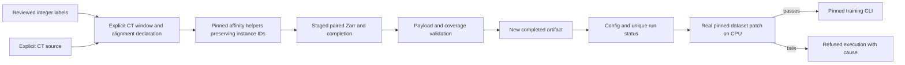

# Design and architecture review: Mutex data handoff

Reviewed baseline `974ab5aa`, following the volumetric-label review. This focused
pass covers the curated segmentation-to-Mutex data handoff, the maintained
launcher, its compatibility entrypoint and example config, and the action-matrix
consumer. These are research CLI workflows.

## Findings and repairs

| Priority | Verified problem | Repair |
|---|---|---|
| P1 | Raw CT pairing depends on filename substrings and filesystem search. Shape/origin/alignment are implicit. | Require explicit raw and label sources, strict 3D arrays, a fully contained raw window, and a caller alignment declaration. Record source attributes, origin, shapes, and semantics. |
| P1 | Export converts integer IDs to float32, collapses adjacent large IDs, ambiguously tests bare Zarr membership, and implicitly takes a channel from 4D data. | Preserve exact dtypes/IDs, select only bare arrays or explicit level 0, reject 4D inputs, and specify grayscale ZYX TIFF export. Prepare raw/graph Zarr directly. |
| P1 | The upstream graph CLI relabels all foreground components, erasing boundaries between touching instance IDs. Image and graph stems cannot be paired by the pinned loader. | Compare original IDs using the actual pinned affinity helpers and publish matching stems. Provide a separate declared binary-component mode. Mask zeros rather than supervise rejected/unevaluated chunks. |
| P1 | Preparation writes directly into existing paths and exits successfully after some refusals. Sparse full-scroll labels are materialized without a bound. | Require new source-disjoint outputs, bound the selected fragment before reading, stage all data and metadata, validate before publication, and propagate nonzero CLI exits. |
| P1 | Launcher config declares no output heads and uses an ignored complement key. Nonempty junk directories pass readiness. | Declare both heads and actual offset-derived channel counts, use the canonical `invert` key, and validate completion together with actual image/graph payloads and patch dimensions. Repair the checked-in example. |
| P1 | The pinned runtime cannot import here (`nrrd` absent). Its loader slices channel-leading graphs as spatial arrays and passes 4D affinities to a 3D crop helper. | Require a real dataset-patch CPU probe before training; refuse failed or unverified probes. Record the upstream incompatibility as a strict expected-failure regression. Upstream sources and environment dependencies remain unchanged. |
| P2 | Markers report execution merely because it was requested, and a 64-voxel patch alone is called submittable. Default dry runs overwrite committed config/history. The root shim targets a missing moved script. | Record actual process start/PID and outcome separately from requests, preparation, and runtime checks. Eligibility remains unknown. Use unique ignored run folders and fix the shim and legacy flag forwarding. |
| P2 | The action matrix reads the historical Mutex marker and infers readiness from prepared data. | Read the latest local run or an explicit marker, preserve its actual state, and remove patch-only eligibility language. |

The initial targeted regression run reproduced **8 failures**, covering ID loss,
bare-array/channel handling, a false-success exit, bogus readiness, missing
head/complement configuration, false execution reporting, and the moved shim.

## Architecture and operator design

Shared `scripts/training/mutex_data.py` owns the fragment schema and bounded
readiness checks. It reuses existing canonical path, staging, integer, volume,
and JSON helpers. Graph computation calls the pinned upstream helpers directly;
no graph, model, loss, crop, or training implementation is copied or patched.

The [operator guide](MUTEX_DATA.md) documents exact commands, inputs, memory
bounds, semantic modes, masked coverage, status fields, publication, and migration.
Preparation is distinct from loader compatibility and scientific validation.
The CPU gate reads actual image/target/mask tensors through villa rather than
replacing the broken loader with a local adaptation.

## Verification

- Standard validation:
  `OMP_NUM_THREADS=2 MKL_NUM_THREADS=2 MPLCONFIGDIR=/tmp/vesuvius-matplotlib .venv/bin/python scripts/run_validation_tests.py`
  — **843 passed, 3 skipped, 1 expected failure, 9 warnings** in 105.28 s.
  The runner includes **75 passing new regression cases** and the pinned loader
  expected failure. Skips require optional CUDA/live-S3 capabilities; warnings
  concern CPU data-loader pinning.
- Focused workflow and action-matrix integration:
  `OMP_NUM_THREADS=2 MKL_NUM_THREADS=2 MPLCONFIGDIR=/tmp/vesuvius-matplotlib .venv/bin/python -m pytest tests/test_mutex_data_contracts.py tests/test_villa_prize_action_matrix.py tests/test_villa_baselines_launchers.py::test_launch_mutex_writes_marker_and_blocks_execute_without_data -q --no-header --tb=short`
  — **78 passed, 1 expected failure** in 6.38 s. Fixtures use real local Zarr,
  TIFF round trips, and the pinned affinity computation. They cover large uint32/
  uint64 touching instances, unknown zeros, explicit nonzero raw origins, binary
  components, malformed payloads, aliases, bounded reads, injected publication
  failures, refused probes, actual process-start status, and current consumer
  state. Separate CLI interpreters exercise missing inputs, help, refusal, and
  invocation from outside the checkout. Process-boundary fakes exercise launch
  outcomes without starting training.
- PR-template smoke:
  `OMP_NUM_THREADS=2 MKL_NUM_THREADS=2 MPLCONFIGDIR=/tmp/vesuvius-matplotlib .venv/bin/python scripts/smoke_test.py`
  — **8/11 passed, 3 skipped, 0 failed** in 9.8 s. Skips require absent training
  data or the optional bg2 augmentation transform.
- Documentation, claim, filing, and upstream parity guards:
  `OMP_NUM_THREADS=2 MKL_NUM_THREADS=2 MPLCONFIGDIR=/tmp/vesuvius-matplotlib .venv/bin/python -m pytest tests/test_audit_doc_references.py tests/test_audit_report_claims.py tests/test_withdrawn_claims_stay_withdrawn.py tests/test_arm_tiers.py tests/test_audit_arm_coverage.py tests/test_analyse_flat_displacement.py tests/test_quotations_match_source.py tests/test_analyse_pooled_fit_only_floor.py tests/test_analyse_ink_maximum_offset.py tests/test_filing_2026_10_numbers.py tests/test_fiber_scoring_matches_scrollgt.py tests/test_soft_count_report_numbers.py -q --no-header --tb=short`
  — **106 passed, 16 skipped** in 47.91 s. Skips require the absent sibling
  ScrollGT checkout or external render artifacts.
- Ruff 0.9.10 lint and format checks pass for all **9 changed Python files**,
  using the existing offline tool cache. `git diff --check` passes. No dependency
  was installed or added; the pinned villa tree is unchanged.
- Repository-wide mypy 1.19.1:
  `UV_CACHE_DIR=/workspace/.cache/uv UV_TOOL_DIR=/workspace/.cache/uv-tools uv tool run --offline --from mypy==1.19.1 mypy . --explicit-package-bases --namespace-packages --python-executable .venv/bin/python`
  — **16 errors in 13 files**, checking 615 source files. All diagnostics are
  outside the changed files: missing YAML/requests stubs, OpenCV overloads,
  augmentation slice types, and loader/training tensor-list annotations.
  Repository-wide type checking remains failing.
- An exploratory run of the whole older baseline-launcher test file also fails
  `test_launch_finetune_lejepa_uses_submittable_patch_and_finds_pretrain` because
  its expected local LeJEPA checkpoint is absent. The affected Mutex test passes;
  this unrelated environment-dependent case is not included in the standard
  validation runner.

## Remaining limits

Actual CLI preparation succeeds from outside the checkout on a synthetic
8-cubed uint16 CT and touching uint32 instances above `2**24`. A real `--execute`
attempt returns 2 with artifact validation true, `runtime_failed`, and
`executed: false`; the isolated probe reports the missing `nrrd` import.
This verifies refusal behavior, not end-to-end training.

Executing the actual pinned `ZarrArrayHandle` class independently demonstrates
that reading a `(6, 8, 9, 10)` affinity array at origin `(2, 3, 4)` with size
`(3, 3, 3)` slices the channels/Z/Y axes and leaves X untouched, rather than
returning `(6, 3, 3, 3)`. Dataset patch extraction also passes its 4D targets
to the 3D-only `pad_or_crop_3d` and adds an extra axis. The runtime must be
repaired upstream and its dependency environment made available before training
can be verified. This review does not alter the pinned submodule.

Alignment and label accuracy remain caller obligations; source metadata is
provenance rather than registration or cryptographic attestation. Keep sources
stable and serialize writers. Preparation materializes channel arrays within
the explicit fragment bound; no whole-scroll memory/performance measurement was
performed. No GPU training, new checkpoint, accuracy improvement, or prize
eligibility is claimed. Other experimental wrapper families are outside this
focused review.
