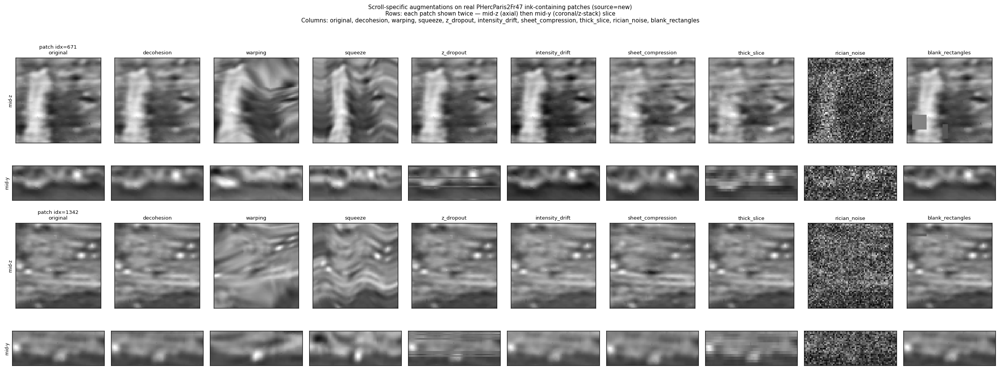

# Scroll-Specific 3D Augmentations

A small, dependency-light library of GPU-native data augmentations that model
the physical artifacts found in Vesuvius Challenge scroll CT volumes. Built for
ink-detection training and aimed at [ScrollPrize/villa issue #201](https://github.com/ScrollPrize/villa/issues/201).

Each augmentation is a pure function on `torch` tensors — no training-loop or
config-object dependency — so the library can be dropped into any PyTorch
pipeline (or ported to villa's `batchgeneratorsv2` Transform protocol).



*Before/after of all nine families on real `PHercParis2Fr47` ink-containing patches.*

## Tensor contract

- `x` (CT volume): `[B, C, Z, H, W]`, float in `[0, 1]`
- `target_ink`: `[B, 1, H, W]`
- `target_fiber`: `[B, 1, 1, H, W]`

Geometric augmentations (`warping`, `squeeze`, `thick_slice`) transform the
targets together with `x` so labels stay registered. All others touch only `x`.
Labels are returned clamped to `[0, 1]`.

## The nine families

| Family | Models | Key parameters |
| --- | --- | --- |
| `decohesion` | Beam scatter / smear from neighbouring z-layers: a z-shifted "ghost" copy plus symmetric z-blur. | `alpha` 0.15–0.45 (blend), `ghost_offset`, `blur_kernel` |
| `warping` | Local elastic deformation (Gaussian-smoothed random displacement field) — a "straight" chunk made wavy without globally squeezing it. | displacement magnitude, smoothing sigma |
| `squeeze` | Sinusoidal X-compression with mild Y-undulation — "compressed regions from normal data". | `scale_range` 0.72–0.92, `shear_range` ±0.18 |
| `z_dropout` | Occasional bad z-slices replaced by the z-mean. | `drop_rate` ≈0.12 |
| `intensity_drift` | Depth-dependent multiplicative intensity scaling — X-ray dose / beam-hardening variation across z. | slope ±0.18, bias ±0.08 |
| `sheet_compression` | Local thinning/compression of the papyrus sheet stack along z. | compression factor |
| `thick_slice` | Simulates thicker effective slices (z-pooling), reducing through-plane resolution. | window size |
| `rician_noise` | Rician/Rayleigh noise characteristic of magnitude CT reconstruction. | noise sigma |
| `blank_rectangles` | Random rectangular dropouts (missing/occluded regions). | count, size range |

See the docstrings in `scroll_augmentations.py` for exact default ranges.

## Usage

The reusable entry point takes an explicit `ScrollAugProbs` (each field is the
per-call application probability, in `[0, 1]`):

```python
import torch
from scroll_augmentations import ScrollAugProbs, apply_scroll_augmentations

x = torch.rand(2, 1, 16, 64, 64)        # [B,C,Z,H,W] CT volume in [0,1]
ink = torch.zeros(2, 1, 64, 64)         # [B,1,H,W]
fiber = torch.zeros(2, 1, 1, 64, 64)    # [B,1,1,H,W]

probs = ScrollAugProbs(decohesion=0.25, squeeze=0.25, blank_rectangles=0.5)
x_aug, ink_aug, fiber_aug = apply_scroll_augmentations(x, ink, fiber, probs)
```

Individual augmentations are also exported (`scroll_decohesion`,
`scroll_warping`, … — see `scroll_augmentations.__all__`) if you want to apply
one deterministically.

### Inside this repo

The autoresearch training loop calls the thin config adapter
`apply_scroll_specific_3d_augmentations(x, ink, fiber, config)`, which reads
`aug_scroll_<family>_p` off the run config and delegates to
`apply_scroll_augmentations`. This is the single source of truth — `train.py`
imports it rather than carrying its own copy.

## Regenerating the demo

```bash
PYTHONPATH=.:scripts/training uv run python scripts/visualize_scroll_augmentations.py --n-patches 2
# -> reports/augmentation_demos/all_families.png
```

## Tests

```bash
PYTHONPATH=.:scripts/training uv run python -m pytest \
  tests/test_scroll_aug_library.py tests/test_scroll_specific_augmentations.py
```

Coverage includes shape/label-bound preservation, the explicit-probability API,
identity at zero probability, and a regression guard asserting all nine families
actually fire when enabled.
